# 第一章 安装和启动Kali

## 简介

Kali Linux，简称Kali，是用于安全攻击的最新Linux发行版。它是BackTrack Linux的后继者。不像多数Linux发行版那样，Kali Linux用于渗透测试。渗透测试是一种通过模拟攻击评估计算机系统或网络安全性的方法。在整本书中，我们将会探索一些Kali Linux所提供的工具。

这一章涉及到Kali Linux在不同场景下的的安装和启动，从插入Kali Linux DVD到配置网络。

对于本书中所有秘籍，我们都要使用带有64为GNOME作为窗口管理器（WM）和架构的Kali Linux（[(http://www.Kali.org/ downloads/]((http://www.Kali.org/ downloads/)）。然而，使用KDE作为WM的用法并不在这本书里设计，你应该能够遵循这些秘籍，并没有多少问题。

## 1.1 安装到硬盘

硬盘的安装是最基本的操作之一。这个任务需要我们不带DVD运行Kali来完成。

> 执行这个秘籍中的步骤会抹掉你的硬盘，并把Kali标记为你电脑上的主操作系统。

### 准备

在解释真个过程之前，需要满足以下要求：

+ 为KaliLinux的安装准备最小8GB的空闲磁盘空间（然而我们推荐至少25GB来存放这本书中额外的程序和生成的词汇表）。
+ 最小512MB的内存。
+ 在[KaliLinux的下载页面](http://www.kali.org/downloads/)下载Kali Linux。

让我们开始安装吧。

### 操作步骤

1.  在光驱中插入Kali Linux Live DVD来开始。你会看到它的启动菜单。选择`Graphical install`（图形化安装）。

    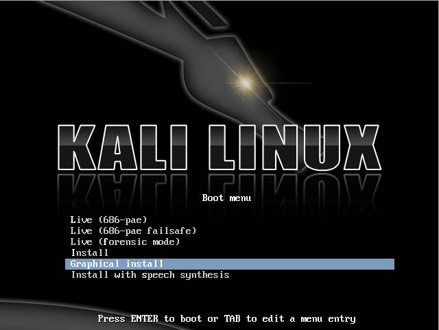

2.  选择语言。这里我们选择`English`（英语）。

    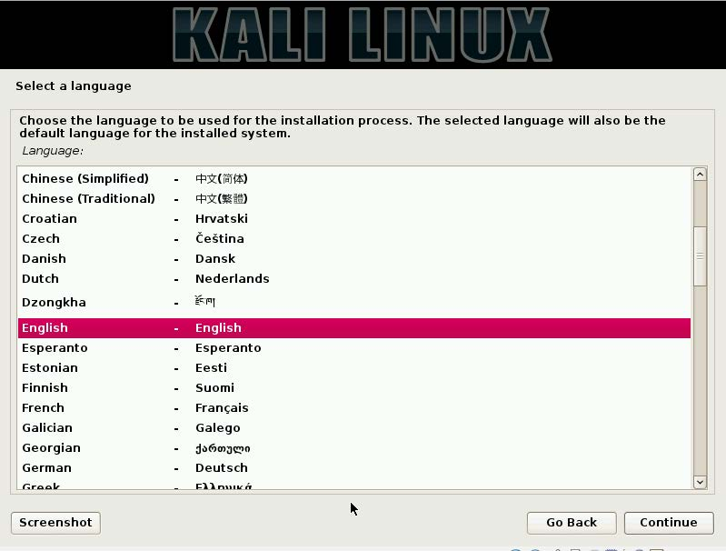

3.  选择你的位置。这里我们选择`United States`（美国）。

    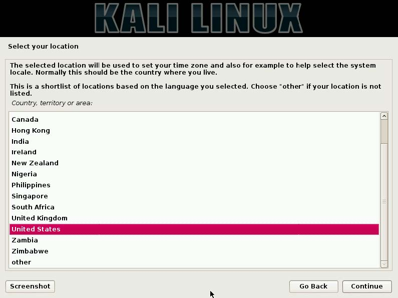

4.  选择你的键盘配置。这里我们选择`American English`（美国英语）。

    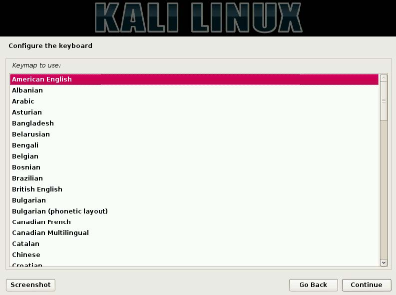

5.  下面要完成网络服务配置。输入主机名称，这里我们输入`Kali`。

    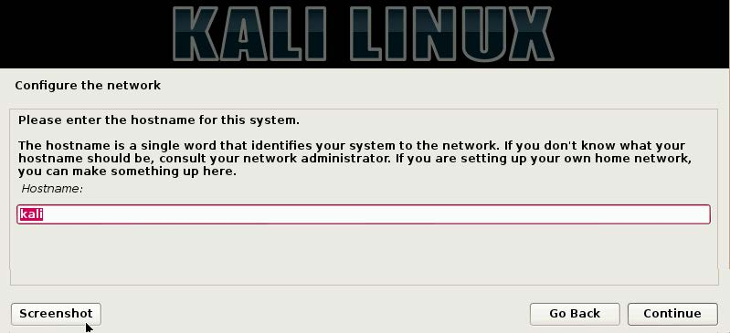

6.  下面，我们需要输入域名。这里我们输入`kali.secureworks. com`。

    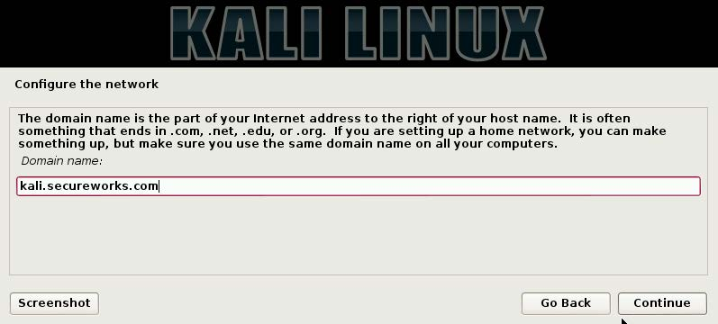

7.  现在你会看到输入root密码的地方，需要输入两次。

    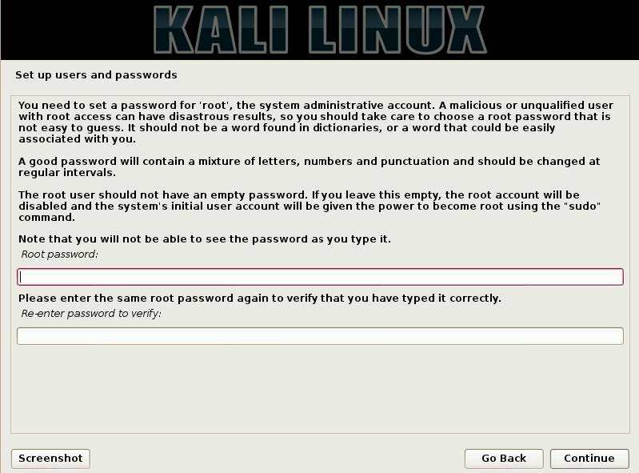

8.  选择你的时区，这里我们选择`Eastern`（东方）。

    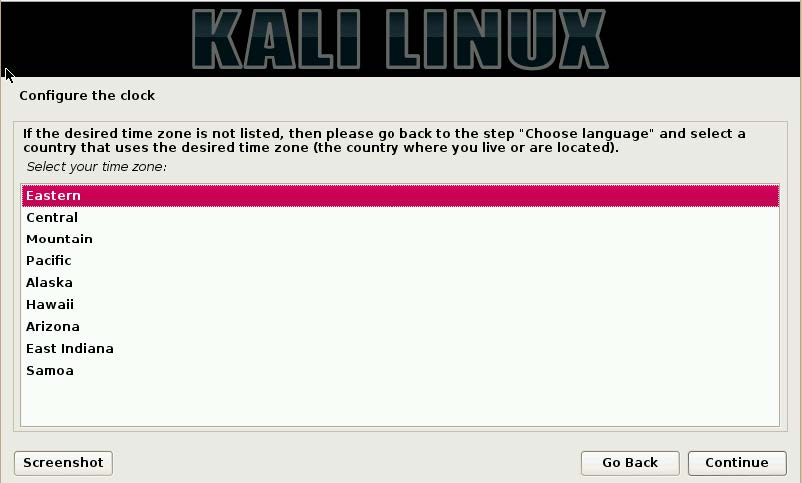

9.  我们现在可以选择磁盘分区方式。你会看到四个选项。选择`Guided - use entire disk`，这会便于你分区。

    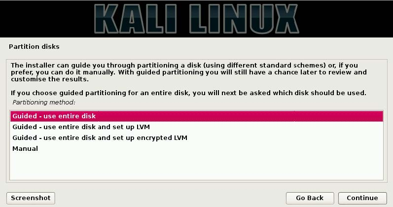

0.  在这一步，你需要知道你的磁盘会被抹掉，点击`Continue`（继续）。

    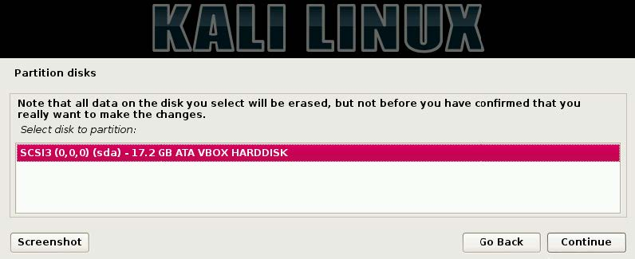

1.  下面，你有机会选择三个分区方式之一：所有文件放在一个分区、分离`/home`、以及分离`/home/user/var`和`/tmp`。考虑到Kali用于渗透测试，分区不需要也不必要（即使这对于你的桌面主操作系统是个好主意）。这里我们选择` All files in one partition`（所有文件放在一个分区）并点击`Continue`（继续）。

    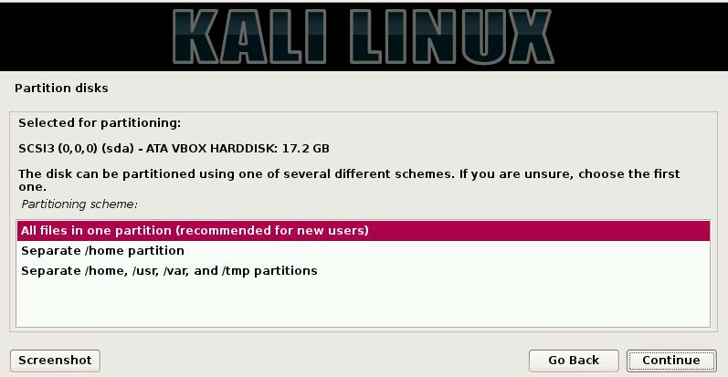

2.  一旦你看到了一个界面，让你知道将要对你磁盘执行的改动，选择`Yes`之后点击`Continue`（继续）。要注意这是撤销抹掉你磁盘所有数据的最后机会。

    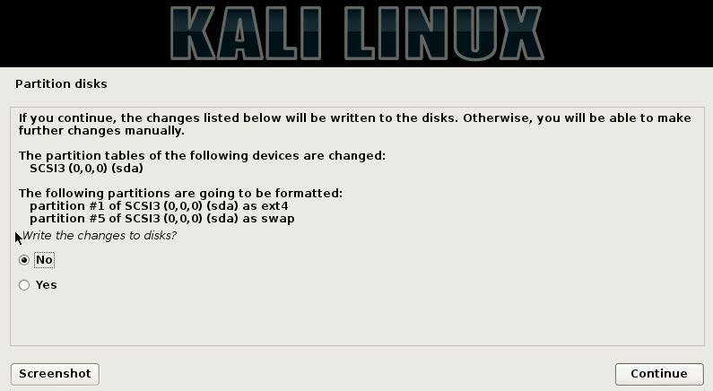

3.  下面，你会被询问是否希望链接到网络镜像。网络镜像允许你接收到Kali的更新。这里我们选择`Yes`之后点击`Continue`（继续）。

    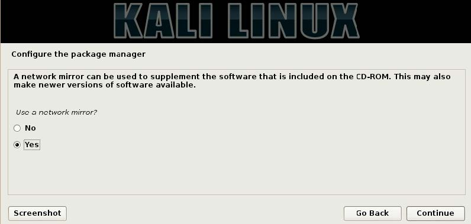

4.  你可以通过点击`Continue`（继续）跳过HTTP代理界面。

    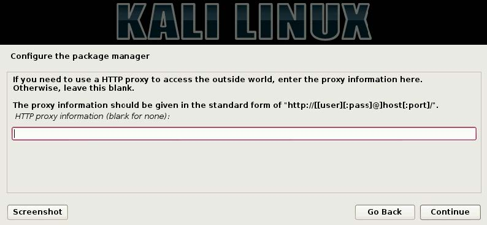

5.  最后，你会被询问来安装GRUB启动器到主引导记录（MBR）中。选择`Yes`之后点击`Continue`（继续）。

    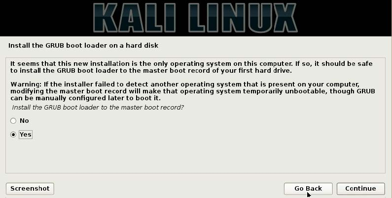

6.  祝贺你现在完成了Kali Linux的安装！点击`Continue`，系统会重启并展示登录界面。

    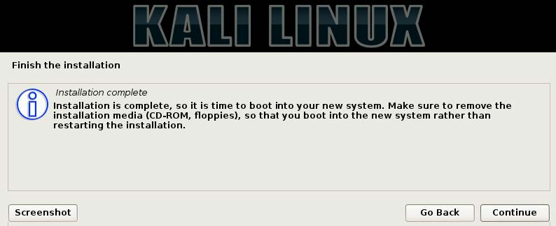

## 1.2 安装到U盘或持久存储器中

Kali Linux U盘能够持久化储存系统设置，以及在U盘中永久升级和安装新的软件包，并让我们将个人定制的Kali Linux随时带在身上。

多亏了Win32 Disk Imager，我们可以为大多数Linux发行版创建可启动的U盘，包括持久化存储的Kali Linux。

### 准备

需要下列工具和准备工作以继续：

+ FAT32格式的U盘，最小8GB。
+ Kali Linux ISO镜像。
+ [Win32 Disk Imager](http://sourceforge.net/projects/win32diskimager/)。
+ 你可以从[这里](http://www.kali.org/downloads/)下载Kali。

### 操作步骤

让我们开始讲Kali Linux安装到U盘：

1.  插入格式化且可写入的U盘：

    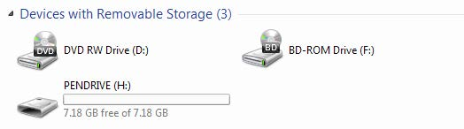

2.  启动 Win32 Disk Imager。

    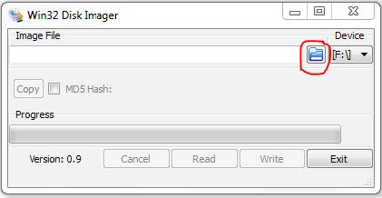

3.  点击目录图表，选择Kali Linux DVD ISO镜像的位置：

    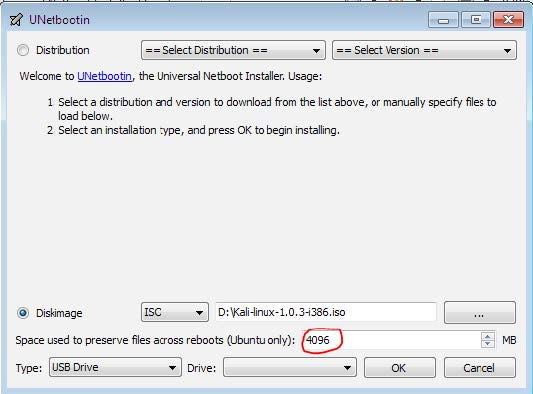

4.  确保“Space used to preserve files across reboots”（用于在启动中保存文件的空间）设置为4096。

    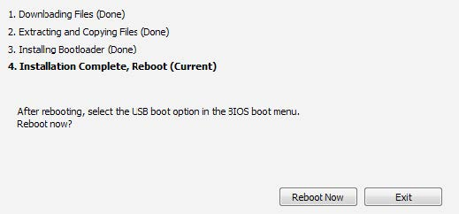

5.  选择我们的U盘，并点击OK按钮来开始创建可启动的U盘：

    

6.  当它解压并复制DVD的文件到U盘，以及安装bootloader时，这个过程会花一些时间来完成。

7.  安装完成之后，我们就可以重启电脑，从新创建的Kali Linux U盘以持久存储器来启动了。

    
