# 第三章 高级测试环境

> 作者：Willie L. Pritchett, David De Smet

> 译者：[飞龙](https://github.com/)

> 协议：[CC BY-NC-SA 4.0](http://creativecommons.org/licenses/by-nc-sa/4.0/)

## 简介

既然我们已经了解了 Kali Linux 所包含的工具，现在我们要调查一些真实世界的场景。我们进行的许多攻击都有意在有漏洞的软件和系统上执行。但是，当你使用 Kali 攻击一个系统时，它不可能像我们当前的测试平台那样没有防护。

这一章中，我们会探索一些技巧，来建立起一些真实的测试环境。在当前的信息技术水平中，多数公司都使用平台即服务（PAAS）解决方案，云服务器主机，或者使用小型网络，它们由桌面、服务器和防火墙（单独）或防火墙和路由的组合组成。我们会建立这些环境，之后对它们发起攻击。

我们所有攻击的目的都是获取 root 级别的访问。

## 3.1 熟悉 VirtualBox

在第一章（安装和启动Kali）中，我们简要谈多了 VirtualBox 的用法，便于在虚拟环境中安装 Kali Linux。VirtualBox 是 Oracle 的现有产品，并且作为应用运行在宿主操作系统上。它通过创建虚拟环境允许操作系统安装并运行。这个工具极其重要，可以提供靶机来测试你的 Kali Linux 技巧。

这一章中，我们会极大依赖VirtualBox，并且会修改它的配置来得到我们希望的网络配置类型。我们将这一节作为每个场景单元的起点，所以关键要熟悉这些步骤。

### 准备

需要因特网或内部网络的链接来完成这个模块。

### 操作步骤

让我们通过打开VirtualBox 来开始：

1.  启动VirtualBox ，并点击`New`来开启虚拟机向导：

    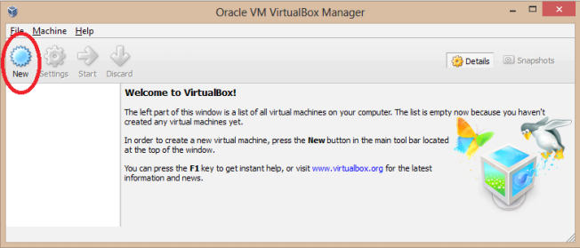
    
2.  点击`Next`按钮，输入虚拟机的名称，并选择 OS 类型和版本：这一章中我们会使用 Linux、Solaris 或 Windows 操作系统。选择合适的操作系统并点击`Next`按钮来继续：

    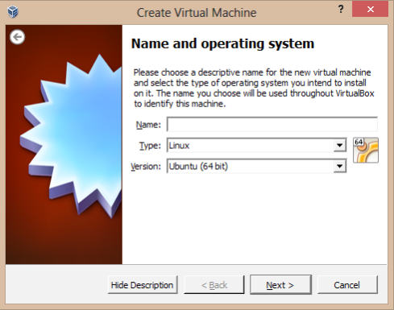
    
3.  选择基本内存（RAM）的总量，它们会分配给虚拟机。我们使用默认值。点击`Next`。

4.  为新的虚拟机创建新的虚拟硬盘，点击`Next`按钮。

    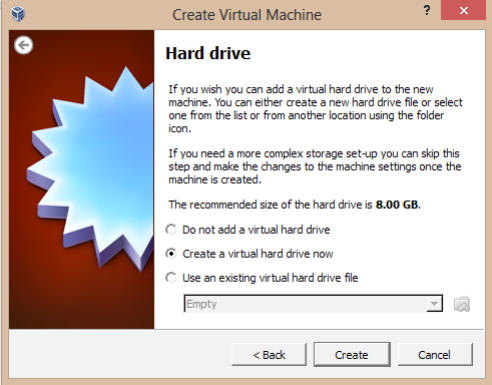
    
5.  新的向导窗口会打开。保留默认的 VDI 文件类型，因为我们不打算使用其它可视化软件。

6.  我们会在虚拟磁盘储存上保留默认选项。点击`Next`来继续。

7.  设置虚拟磁盘文件位置和大小：

    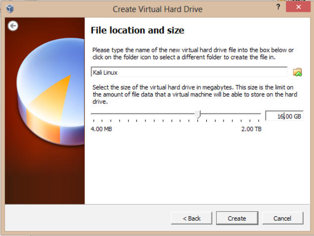
    
8.  检查设置是否正确，并且点击`Create`按钮来开始创建虚拟磁盘文件。

9.  我们现在回到前一个向导，展示了虚拟机参数的汇总。点击`Create`来结束：

    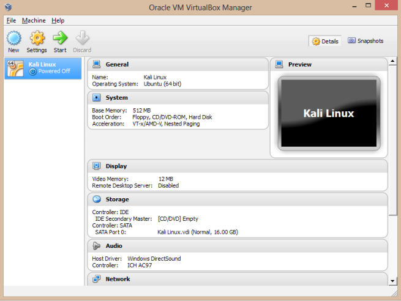
    
0.  创建新的虚拟机之后，我们准备好了安装操作系统，它刚刚在 VirtualBox中配置好。

1.  在VirtualBox的主窗口中，选中我们刚刚创建的操作系统名称，之后点击`Settings`按钮：

    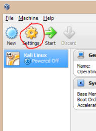
    
2.  既然基本的安装步骤已经完成了，我们现在使用下载的 ISO 文件作为虚拟光盘。这会节省你烧录物理 DVD 来完成安装的时间。在`Settings`界面，点击`Storage`菜单项：

    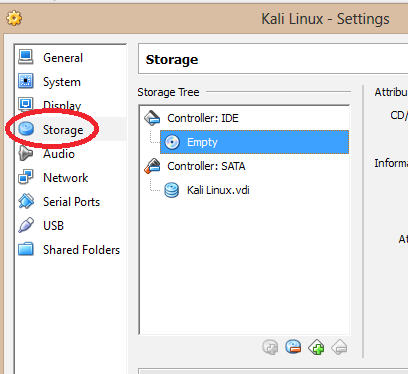
    
3.  之后，在`Storage Tree`下面，选中`Controller: IDE`下面的`Empty`光盘图标。这会选择我们的“虚拟” CD/DVD ROM 驱动。在屏幕的右边，`Attribute`下面，点击光盘图标。在弹出的菜单中，从列表中选择你的 ISO 文件。如果 ISO 文件没有出现，选择`Choose a virtual CD/DVD disc file... `选项并找到你的 ISO。一旦你完成了这些步骤，点击`OK`按钮。

    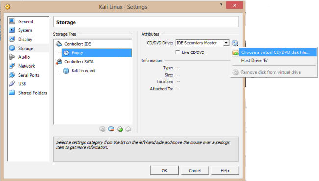
    
4.  点击`Start`按钮，之后点击内部的新窗口，并执行安装。安装步骤在这一章的“安装到硬盘”中有所涉及。

### 工作原理

这一章以创建新的VirtualBox虚拟实例来开始，之后我们选择了我们的操作系统，并设置内存和硬盘大小。之后，我们选择了 ISO 文件，之后将 ISO 插入我们的虚拟 CD/DVD 驱动器中。最后，我们启动了虚拟环境，便于安装操作系统。

在这一章的剩余部分中，我们会使用VirtualBox作为所选工具来建立不同的环境。

### 更多

我们所执行的操作可能会让主机不稳定甚至崩溃。VirtualBox提供了杰出的工具来备份虚拟环境：

1.  在主窗口中，点击你打算备份的虚拟服务器：

2.  右击虚拟服务器，点击`Clone`菜单项：

    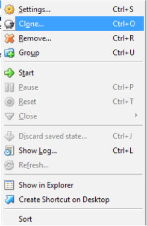
    
3.  在克隆窗口中，为你的新虚拟服务器输入名称。

    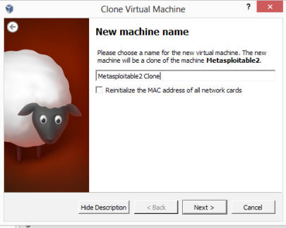
    
4.  点击`Next`，在随后的界面中，选择`Linked clone `或`Full clone`，它们在下面展示：

    +   `Full clone`：在完整克隆的模式中，会创建完全独立的虚拟机备份。
    +   `Linked clone`：在链接克隆的模式中，会截取快照来创建备份。但是，链接克隆依赖于原始文件的功能。这会降低链接克隆的性能。
    
    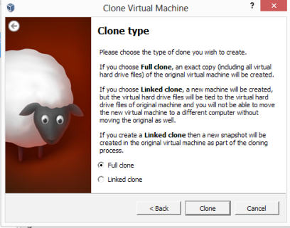

5.  点击`Clone`并等待虚拟机克隆完成。

    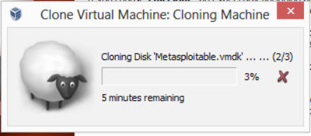

## 3.2 下载 Windows 靶机

到目前为止，以及可见的未来中，微软的 Windows 系统都是许多个人和企业所选的操作系统。

幸运的是，微软提供了一种方法来获取测试操作系统。

### 准备

需要互联网或内部网络连接来完成这个模块。

### 操作步骤

下载 Windows 靶机的步骤如下所示：

1.  打开浏览器并访问 Microsoft Technet：<http://technet. microsoft.com/en-us/ms376608>。

2.  在屏幕的右侧，点击`Downloads`链接：

    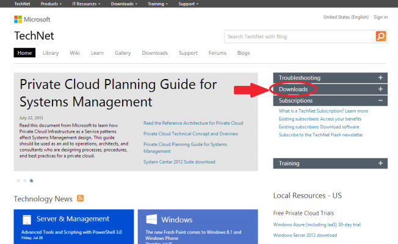
    
3.  在`Download`菜单项中，选择`Evaluate new products`。

    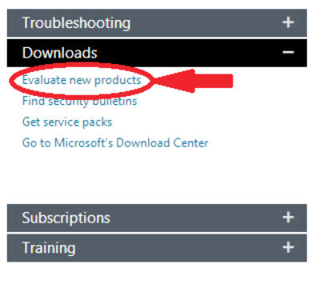

4.  在下一个界面中，你可以选择要下载的东西，取决于你想要测试的产品。推荐你选择 Windows Server 2012，Windows 8 和 Windows 7。

    
    
5.  一旦你下载了 ISO，请遵循这一章“熟悉VirtualBox”秘籍中的指南。

    
## 3.3 下载 Linux 靶机

对于多数的面向 Web 的服务器的部署，Linux 是一种备选的操作系统。与 Windows 先比，它的开销相对较低（主流发行版免费），这使它成为多数云主机、PAAS和服务器环境的理想操作系统。

这个秘籍中，我们会示例如何下载多种 Linux 发行版。

### 准备

需要互联网或内部网络连接来完成这个模块。

### 操作步骤

下载 Linux 靶机的步骤如下所示：

1.  打开浏览器并访问 Distro Watch：<http://www.distrowatch.com>。

2.  你会看到超过 100 个 Linux 发行版的列表。推荐选择一个最小的发行版，而不是流行的版本（CentOS、Ubuntu、Fedora 和 Debian）。这个页面像下面这样：

    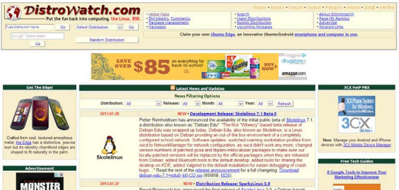

3.  一旦你下载了 ISO，请遵循这一章“熟悉VirtualBox”秘籍中的指南。

## 3.4 攻击 WordPress 和其它应用

选择越来越多的公司在日常业务中使用 SAAS （软件及服务）工具。例如，公司普遍使用 WordPress作为网站的内容管理系统，或 Drupal 作为内部网络。在这些应用中定位漏洞的能力具有极大的价值。

收集被测试应用的一个很好的方式就是 [Turnkey Linux](http://www. turnkeylinux.org)。这个秘籍中，我们会下载流行的 WordPress Turnkey Linux 发行版。

### 准备

需要互联网或内部网络连接来完成这个模块。

### 操作步骤

攻击 WordPress 应用的步骤如下所示：

1.  打开浏览器并访问 Turnkey Linux 的主页：<http://www. turnkeylinux.org>。主页如图所示：

    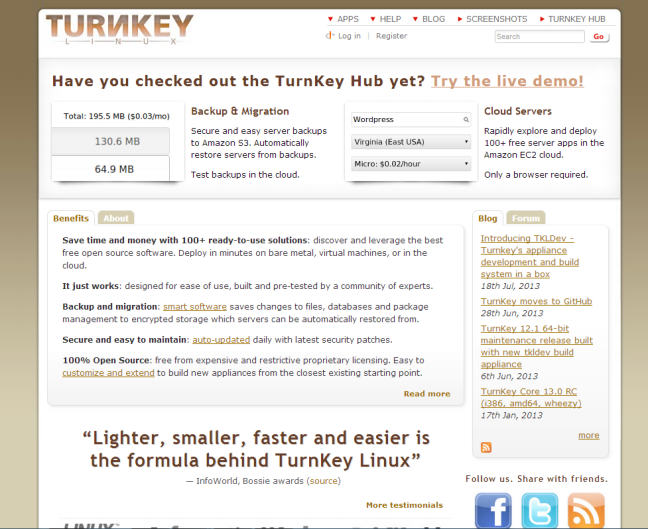

2.  有许多应用在这里列出，我推荐都试试它们，便于你发现漏洞并提升这方面的技能。但是，对于这个秘籍，我们只测试 WordPress。在` Instant Search`框中，输入`WordPress`。

    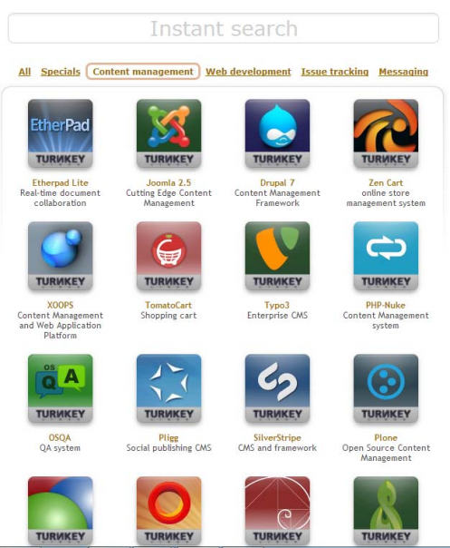
    
3.  在 WordPress 下载页面中，选择 ISO 镜像。下载完成后，请遵循这一章“熟悉VirtualBox”秘籍中的指南：

    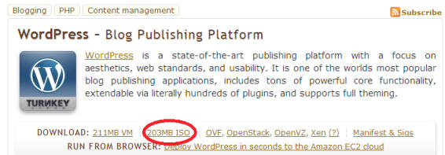
    
### 更多

既然我们加载的 WordPress 虚拟机，我们可以使用 WPScan 来攻击它了。WPScan 是个黑盒的 WordPress 安全扫描器，允许用户发现 WordPress 上的漏洞。

WPScan 接受多种参数，包括：

+   `-u <目标域名或 url>`：参数`u`允许你指定目标的域名。

+   `-f`：参数`f`允许你强制检查WordPress是否安装。

+   `-e[选项]`：参数`e`允许你设置枚举。

让我们开始使用 WPScan。

> 确保你的 WordPress虚拟机和 Kali Linux 虚拟机都开着，并使用`VirtualBox Host Only Adapter `网络设置。

1.  在 Kali Linux 虚拟机中，加载器 WPScan 帮助文件：

    ```
    wpscan -h
    ```
    
    页面会像下面这样：
    
    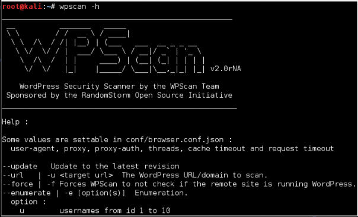
    
2.  让我们对WordPress虚拟机执行基本的 WPScan测试。这里，我们靶机的IP地址是`192.168.56.102`。

    ```
    wpscan –u 192.168.56.102
    ```
3.  现在，让我们通过执行下列命令枚举用户名列表：

    ```
    wpscan –u 192.186.56.102 –e u vp
    ```
    
    页面会像下面这样：
    
    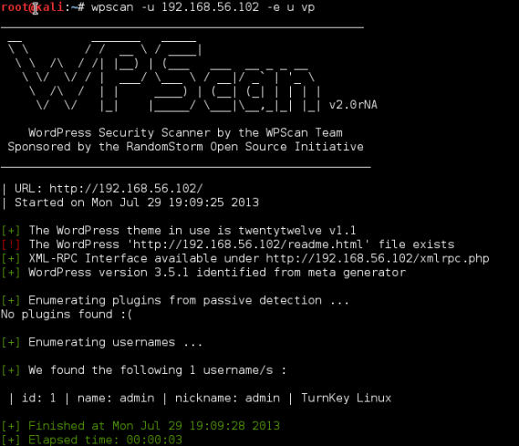
    
4.  最后，我们通过使用`–wordlist <文件路径>`选项来提供单词列表：

    ```
    wpscan –u 192.168.56.102 -e u --wordlist /root/wordlist.txt
    ```
    
    页面会像下面这样：
    
    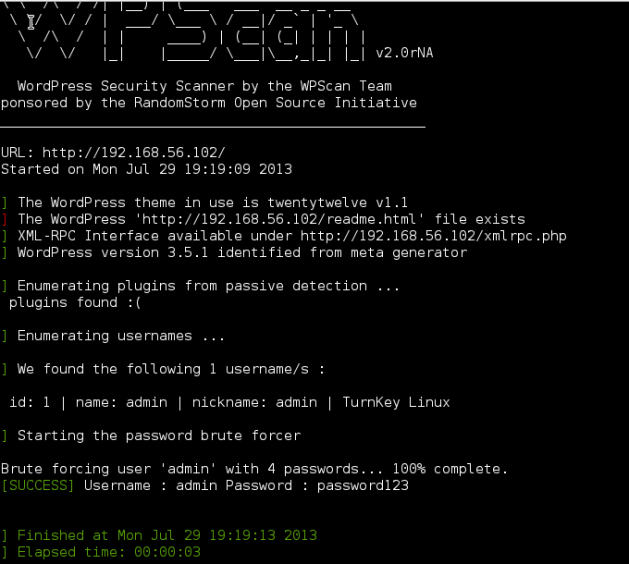
    
5.  这就结束了。我们已经成功获取了 WordPress 的密码。
