# 第五章 漏洞评估

> 作者：Willie L. Pritchett, David De Smet

> 译者：[飞龙](https://github.com/)

> 协议：[CC BY-NC-SA 4.0](http://creativecommons.org/licenses/by-nc-sa/4.0/)

## 简介

扫描和识别目标的漏洞通常被渗透测试者看做无聊的任务之一。但是，它也是最重要的任务之一。这也应该被当做为你的家庭作业。就像在学校那样，家庭作业和小测验的设计目的是让你熟练通过考试。

漏洞识别需要你做一些作业。你会了解到目标上什么漏洞更易于利用，便于你发送威力更大的攻击。本质上，如果攻击者本身就是考试，那么漏洞识别就是你准备的机会。

Nessus 和 OpenVAS 都可以扫描出目标上相似的漏洞。这些漏洞包括：

+ Linux 漏洞
+ Windows 漏洞
+ 本地安全检查
+ 网络服务漏洞

## 5.1 安装、配置和启动 Nessus

在这个秘籍中，我们会安装、配置和启动 Nessus。为了在我们所选的目标上定位漏洞，Nessus 的漏洞检测有两种版本：家庭版和专业版。

+ 家庭版：家庭版用于非商业/个人用途。以任何原因在专业环境下适用 Nessus 都需要使用专业版。
+ 上夜班：专业版用于商业用途。它包括支持和额外特性，例如无线的并发连接数，以及其它。如果你是一个顾问，需要对某个客户执行测试，专业版就是为你准备的。

对于我们的秘籍，我们假定你使用家庭版。

### 准备

需要满足下列需求：

+ 需要网络连接来完成这个秘籍。
+ Nessus 家庭版的有效许可证。

### 操作步骤

让我们开始安装、配置和启动 Nessus， 首先打开终端窗口：

1.  打开 Web 浏览器，访问这个网址：<http://www. tenable.com/products/nessus/select-your-operating-system>。

2.  在屏幕的左侧，`Download Nessus`的下面，选择`Linux`并且选择`Nessus-5.2.1-debian6_amd64.deb`（或新版本）。

    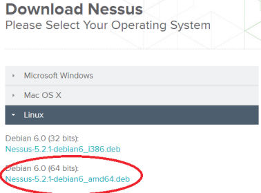

3.  将文件下载到本地根目录下。

    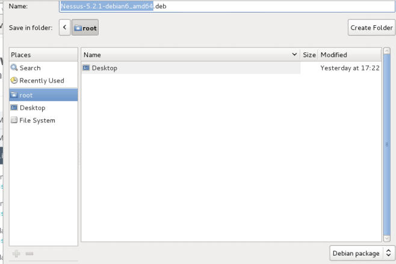

4.  打开终端窗口

5.  执行下列命令来安装 Nessus：

    ```
    dpkg -i "Nessus-5.2.1-debian6_i386.deb"
    ```

    这个命令的输出展示在下面：

    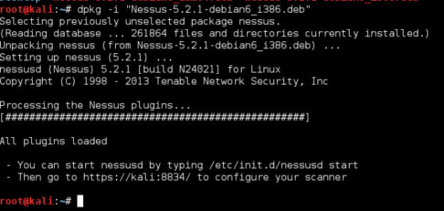

6.  Nessus 会安装到`/opt/nessus`目录下。

7.  一旦安装好了，你就能通过键入下列命令启动 Nessus：

    ```
    /etc/init.d/nessusd start
    ```

    > 在你启动 Nessus 之前，你需要先拥有注册码。你可以从“更多”一节中得到更多信息。

8.  通过执行下列命令，激活你的 Nessus：

    ```
    /opt/nessus/bin/nessus-fetch --register XXXX-XXXX-XXXX-XXXX- XXXX
    ```

    这一步中，我们会从<http://plugins.nessus.org>获取新的插件。

    > 取决于你的网络连接，这可能需要一到两分钟。

9.  现在在终端中键入下列命令：

    ```
    /opt/nessus/sbin/nessus-adduser
    ```

0.  在登录提示框中，输入用户的登录名称。

1.  输入两次密码。

2.  回答 Y（Yes），将用户设置为管理员。

    > 这一步只需要在第一次使用时操作。

3.  完成后，你可以通过键入以下命令来启动 Nessus（没有用户账户则不能工作）。

4.  在<https://127.0.0.1:8834>上登录 Nessus。

    > 如果你打算使用 Nessus，要记得从安装在你的主机上 ，或者虚拟机上的kali Linux 版本中访问。原因是，Nessus会基于所使用的机器来激活自己。如果你安装到优盘上了，在每次重启后你都需要重新激活你的版本。

### 工作原理

在这个秘籍中，我们以打开终端窗口，并通过仓库来安装 Nessus 开始。之后我们启动了 Nessus，并为了使用它安装了我们的证书。

### 更多

为了注册我们的 Nessus 副本，你必须拥有有效的许可证，它可以从<http://www.tenable.com/products/nessus/nessus-homefeed>获取。而且，Nessus 运行为浏览器中的 Flash，所以首次启动程序时，你必须为 Firefox 安装 Flash 插件。如果你在使用 Flash 时遇到了问题，访问<www.get.adobe.com/flashplayer>来获得信息。

## 5.2 Nessus - 发现本地漏洞

现在我们已经安装并配置了 Nessus，我们将要执行第一次漏洞测试。Nessus 允许我们攻击很多种类的漏洞，它们取决于我们的版本。我们也需要评估的目标漏洞列表限制为针对我们想要获取的信息类型的漏洞。在这个秘籍中，我们将要以发现本地漏洞开始，这些漏洞针对我们当前使用的操作系统。

### 准备

为了完成这个秘籍，你将要测试你的本地系统（Kali Linux）。

### 操作步骤

让我们开始使用 Nessus 来发现本地漏洞，首先打开 Firefox 浏览器：

1.  在 <https://127.0.0.1:8834> 登录 Nessus。

2.  访问` Policies`。

3.  点击`New Policy`。

    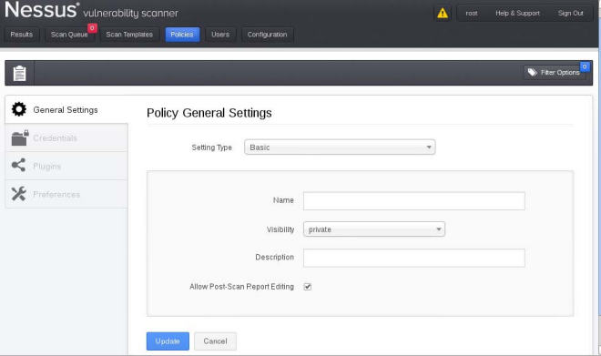

4.  在`General Settings`标签页，进行如下操作：

    1.  在` Settings Type`中选择` Basic`。

    2.  为你的扫描输入一个名称。我们选择了`Local Vulnerability Assessment`，但你可以选择想要的其它名称。

    3.  有两个可见性的选择：‘

        +   `Shared`：其它用户可以利用这次扫描。

        +   `Private`：这次扫描只能被你使用。

    4.  其它项目保留默认。

    5.  点击`Update`。

5.  在`Plugins`标签页中，选择`Disable All`并选择下列特定的漏洞：

    1.  `Ubuntu Local Security Checks `。

    2.  ` Default Unix Accounts`。

    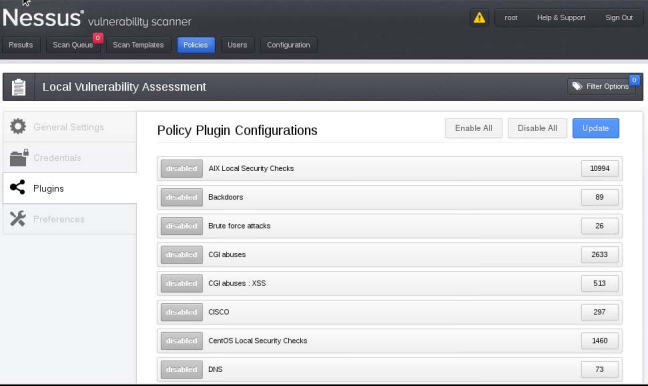

6.  点击`Update`来保存新的策略。

7.  在主菜单中，点击`Scan Queue`菜单选项。

8.  点击`New Scan`按钮并进行如下操作：

    1.  为你的扫描输入名称。如果你一次运行多个扫描，这会非常有用。这是区分当前运行的不同扫描的方式。

    2.  输入扫描类型：

        +   `Run Now`：默认开启，这个选项会立即运行扫描。

        +   `Scehduled`：允许你选择日期和时间来运行扫描。

        +   `Template`：将扫描设置为模板。

    3.  选择扫描策略。这里，我们选择之前创建的`Local Vulnerabilities Assessment`策略。

    4.  选择你的目标，包含下列要点：

        +   目标必须每行输入一个。

        +   你也可以在每行输入目标的范围。

    5.  你也可以上传目标文件（如果有的话）或选择` Add Target  IP Address`。

9.  点击`Run Scan`：

    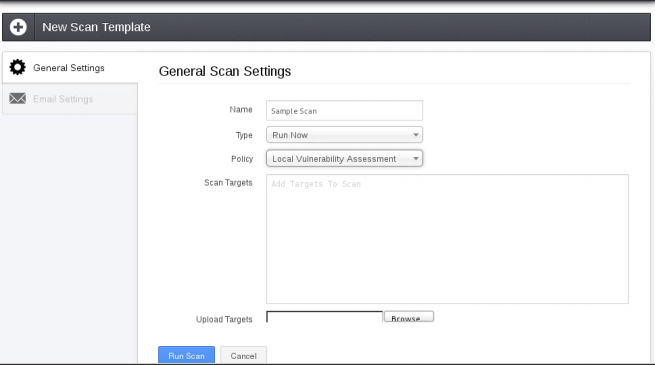

0.  你会被要求确认，你的测试将会执行（取决于你选择了多少目标，以及要执行多少测试）。

1.  一旦完成了，你会收到一份报告。

2.  双击报告来分析下列要点（在`Results`标签页中）：

    +   每个发现了漏洞的目标会被列出。

    +   双击 IP 地址来观察端口，和每个端口的问题。

    +   点击列下方的数字，来获得所发现的特定漏洞的列表。

    +   漏洞会详细列出。

3.  点击`Reports`主菜单中的` Download Report `。

## 5.3 Nessus -  发现网络漏洞

Nessus 允许我们攻击很多种类的漏洞，它们取决于我们的版本。我们也需要评估的目标漏洞列表限制为针对我们想要获取的信息类型的漏洞。这个秘籍中，我们会配置 Nessus 来发现目标上的网络漏洞。这些漏洞针对主机或网络协议。

### 准备

为了完成这个秘籍，你需要被测试的虚拟机。

+ Windows XP
+ Windows 7
+ Metasploitable 2.0
+ 网络防火墙或路由
+ 任何其它 Linux 版本

### 操作步骤

让我们开始使用 Nessus 来发现本地漏洞，首先打开 Firefox 浏览器：

1.  在 <https://127.0.0.1:8834> 登录 Nessus。

2.  访问` Policies`。

3.  点击`Add Policy`。

    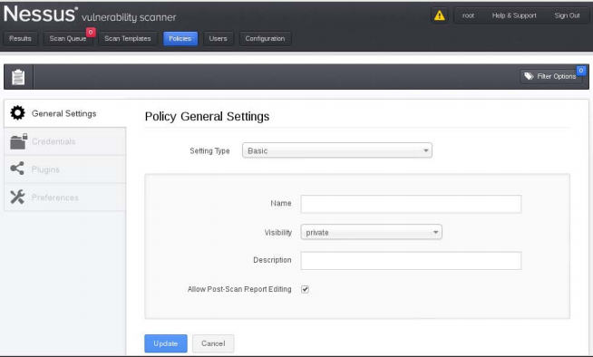

4.  在`General`标签页，进行如下操作：

    1.  为你的扫描输入一个名称。我们选择了`Internal Network Scan`，但你可以选择想要的其它名称。

    2.  有两个可见性的选择：‘

        +   `Shared`：其它用户可以利用这次扫描。

        +   `Private`：这次扫描只能被你使用。

    3.  其它项目保留默认。

    4.  点击`Update`。

5.  在`Plugins`标签页中，点击` Disable All `并选择下列特定的漏洞：

    +   `CISCO`     
    +   `DNS`     
    +   `Default Unix Accounts`     
    +   `FTP`     
    +   `Firewalls`     
    +   `Gain a shell remotely`     
    +   `General`     
    +   `Netware`     
    +   `Peer-To-Peer File Sharing`     
    +   `Policy Compliance`     
    +   `Port Scanners`     
    +   `SCADA`     
    +   `SMTP Problems`     
    +   `SNMP`     
    +   `Service Detection`     
    +   `Settings`

    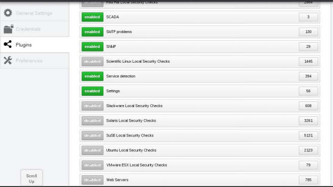

6.  点击`Update`来保存新的策略。

7.  在主菜单中，点击`Scan Queue`菜单选项。

8.  点击`New Scan`按钮并进行如下操作：

    1.  为你的扫描输入名称。如果你一次运行多个扫描，这会非常有用。这是区分当前运行的不同扫描的方式。

    2.  输入扫描类型：

        +   `Run Now`：默认开启，这个选项会立即运行扫描。

        +   `Scehduled`：允许你选择日期和时间来运行扫描。

        +   `Template`：将扫描设置为模板。

    3.  选择扫描策略。这里，我们选择之前创建的`Internal Network Scan`策略。

    4.  选择你的目标，包含下列要点：

        +   目标必须每行输入一个。

        +   你也可以在每行输入目标的范围。

    5.  你也可以上传目标文件（如果有的话）或选择` Add Target  IP Address`。

9.  点击`Run Scan`：

    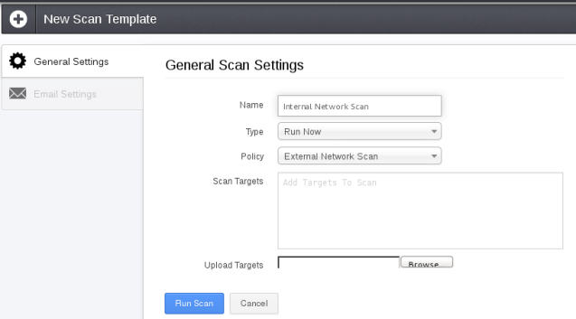

0.  你会被要求确认，你的测试将会执行（取决于你选择了多少目标，以及要执行多少测试）。

    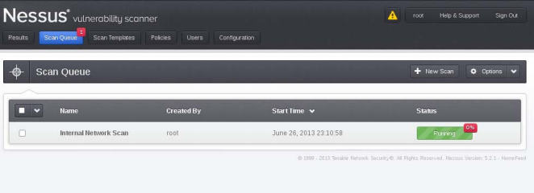

1.  一旦完成了，你会收到一份报告，它在`Results`标签页中。

2.  双击报告来分析下列要点（在`Results`标签页中）：

    +   每个发现了漏洞的目标会被列出。

    +   双击 IP 地址来观察端口，和每个端口的问题。

    +   点击列下方的数字，来获得所发现的特定问题/漏洞的列表。

    +   漏洞会详细列出。

3.  点击`Reports`主菜单中的` Download Report `。

## 5.4 发现 Linux 特定漏洞

在这个秘籍中，我们会使用 Nessus 探索如何发现 Linux 特定漏洞。这些漏洞针对网络上运行Linux的主机。

### 准备

为了完成这个秘籍，你需要被测试的虚拟机：

+  Metasploitable 2.0
+  其它 Linux 版本

### 操作步骤

让我们开始使用 Nessus 来发现 Linux 特定漏洞，首先打开 Firefox 浏览器：

1.  在 <https://127.0.0.1:8834> 登录 Nessus。

2.  访问` Policies`。

3.  点击`Add Policy`。

    

4.  在`General Settings `标签页，进行如下操作：

    1.  为你的扫描输入一个名称。我们选择了`Linux Vulnerability Scan`，但你可以选择想要的其它名称。

    2.  有两个可见性的选择：‘

        +   `Shared`：其它用户可以利用这次扫描。

        +   `Private`：这次扫描只能被你使用。

    3.  其它项目保留默认。

5.  在`Plugins`标签页中，点击` Disable All `并选择下列特定的漏洞。当我们扫描可能在我们的 Linux 目标上运行的服务时，这份列表会变得很长：

    +   `Backdoors`
    +   `Brute Force Attacks`
    +   `CentOS Local Security Checks`
    +   `DNS`  
    +   `Debian Local Security Checks`  
    +   `Default Unix Accounts`  
    +   `Denial of Service`  
    +   `FTP`  
    +   `Fedora Local Security Checks`  
    +   `Firewalls`  
    +   `FreeBSD Local Security Checks`  
    +   `Gain a shell remotely`  
    +   `General`  
    +   `Gentoo Local Security Checks`  
    +   `HP-UX Local Security Checks`  
    +   `Mandriva Local Security Checks`  
    +   `Misc`  
    +   `Port Scanners`  
    +   `Red Hat Local Security Checks`  
    +   `SMTP Problems`  
    +   `SNMP`  
    +   `Scientific Linux Local Security Checks`  
    +   `Slackware Local Security Checks`  
    +   `Solaris Local Security Checks`
    +   `SuSE Local Security Checks`  
    +   `Ubuntu Local Security Checks`  
    +   `Web Servers`

    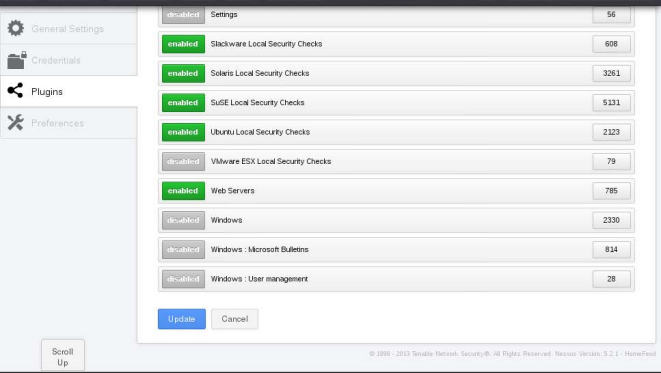

6.  点击`Update`来保存新的策略。

7.  在主菜单中，点击`Scan Queue`菜单选项。

8.  点击`New Scan`按钮并进行如下操作：

    1.  为你的扫描输入名称。如果你一次运行多个扫描，这会非常有用。这是区分当前运行的不同扫描的方式。

    2.  输入扫描类型：

        +   `Run Now`：默认开启，这个选项会立即运行扫描。

        +   `Scehduled`：允许你选择日期和时间来运行扫描。

        +   `Template`：将扫描设置为模板。

    3.  选择扫描策略。这里，我们选择之前创建的`Linux Vulnerabilities Scan`策略。

    4.  选择你的目标，包含下列要点：

        +   目标必须每行输入一个。

        +   你也可以在每行输入目标的范围。

        +   上传目标文件（如果有的话）或选择` Add Target  IP Address`。

9.  点击`Launch Scan`：

    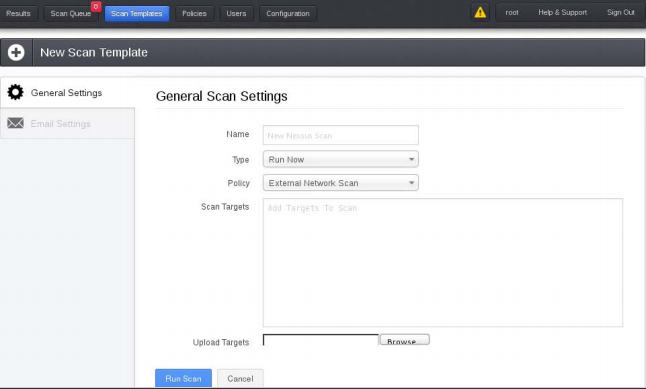

0.  你会被要求确认，你的测试将会执行（取决于你选择了多少目标，以及要执行多少测试）。

1.  一旦完成了，你会收到一份报告，它在 `Reports`标签页中。

2.  双击报告来分析下列要点：

    +   每个发现了漏洞的目标会被列出。

    +   双击 IP 地址来观察端口，和每个端口的问题。

    +   点击列下方的数字，来获得所发现的特定问题/漏洞的列表。

    +   漏洞会详细列出。

3.  点击`Reports`主菜单中的` Download Report `。

## 5.5 Nessus - 发现 Windows 特定的漏洞

在这个秘籍中，我们会使用 Nessus 探索如何发现 Windows 特定漏洞。这些漏洞针对网络上运行 Windows 的主机。

### 准备

为了完成秘籍，你需要被测试的虚拟机：

+ Windows XP
+ Windows 7

### 操作步骤

让我们开始使用 Nessus 发现 Windows 特定的漏洞，首先打开 Firefox 浏览器：

1.  在 <https://127.0.0.1:8834> 登录 Nessus。

2.  访问` Policies`。

3.  点击`Add Policy`。

    

4.  在`General Settings `标签页，进行如下操作：

    1.  为你的扫描输入一个名称。我们选择了` Windows Vulnerability Scan`，但你可以选择想要的其它名称。

    2.  有两个可见性的选择：‘

        +   `Shared`：其它用户可以利用这次扫描。

        +   `Private`：这次扫描只能被你使用。

    3.  其它项目保留默认。

    4.  点击`Submit`。

5.  在`Plugins`标签页中，点击` Disable All `并选择下列特定的漏洞。它们可能出现在 Windows 系统中：

    +   DNS  Databases  
    +   Denial of Service  
    +   FTP  
    +   SMTP Problems  
    +   SNMP  Settings  
    +   Web Servers  
    +   Windows  
    +   Windows: Microsoft Bulletins  
    +   Windows: User management

    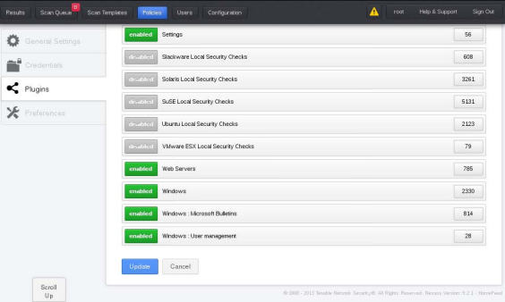

6.  点击`Submit`来保存新的策略。

7.  在主菜单中，点击`Scan`菜单选项。

8.  点击`Add Scan`按钮并进行如下操作：

    1.  为你的扫描输入名称。如果你一次运行多个扫描，这会非常有用。这是区分当前运行的不同扫描的方式。

    2.  输入扫描类型：

        +   `Run Now`：默认开启，这个选项会立即运行扫描。

        +   `Scehduled`：允许你选择日期和时间来运行扫描。

        +   `Template`：将扫描设置为模板。

    3.  选择扫描策略。这里，我们选择之前创建的`Windows Vulnerabilities Scan`策略。

    4.  选择你的目标，包含下列要点：

        +   目标必须每行输入一个。

        +   你也可以在每行输入目标的范围。

        +   上传目标文件（如果有的话）或选择` Add Target  IP Address`。

9.  点击`Launch Scan`：

    

0.  你会被要求确认，你的测试将会执行（取决于你选择了多少目标，以及要执行多少测试）。

1.  一旦完成了，你会收到一份报告，它在 `Reports`标签页中。

2.  双击报告来分析下列要点：

    +   每个发现了漏洞的目标会被列出。

    +   双击 IP 地址来观察端口，和每个端口的问题。

    +   点击列下方的数字，来获得所发现的特定问题/漏洞的列表。

    +   漏洞会详细列出。

3.  点击`Reports`主菜单中的` Download Report `。

## 5.6 安装、配置和启动 OpenVAS

OpenVAS，即开放漏洞评估系统，是一个用于评估目标漏洞的杰出框架。它是 Nessus 项目的分支。不像 Nessus，OpenVAS提供了完全免费的版本。由于 OpenVAS 在Kali Linux中成为标准，我们将会以配置开始。

### 准备

需要网络连接。

### 操作步骤

让我们开始安装、配置和启动 OpenVAS，首先在终端窗口中访问它的路径。

1.  OpenVAS 默认安装，并且只需要配置便于使用。

2.  在终端窗口中，将路径变为 OpenVAS 的路径：

    ```
    cd /usr/share/openvas
    ```

3.  执行下列命令：

    ```
    openvas-mkcert
    ```

    这一步我们为 OpenVAS 创建了 SSL 证书。

    1.  保留 CA 的默认生命周期。

    2.  更新证书的生命周期，来匹配 CA 证书的天数：`1460`。

    3.  输入国家或地区。

    4.  输入州或省。

    5.  组织名称保留默认。

    6.  你会看到证书确认界面，之后按下回车键来退出。

    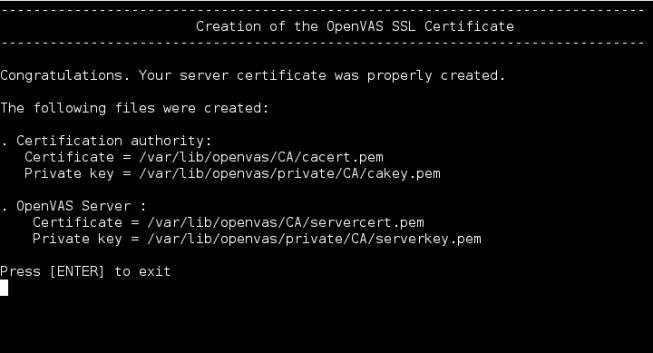

4.  执行下列命令：

    ```
    openvas-nvt-sync
    ```

    这会将 OpenVAS NVT 数据库和当前的 NVT 版本同步。也会更新到最新的漏洞检查。

    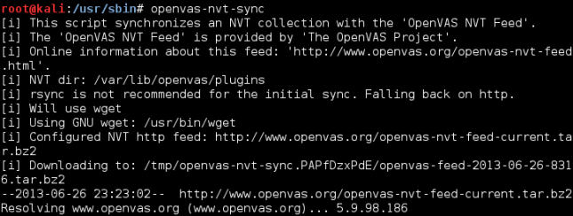

5.  执行下列命令：

    ```
    openvas-mkcert-client -n om -i
    openvasmd -rebuild
    ```

    这会生成客户证书并分别重构数据库。

6.  执行下列命令：

    ```
    openvassd
    ```

    这会启动 OpenVAS 扫描器并加载所有插件（大约 26406 个），所以会花一些时间。

7.  执行下列命令：

    ```
    openvasmd --rebuild
    openvasmd --backup
    ```

8.  执行下列命令来创建你的管理员用户（我们使用 `openvasadmin`）：

    ```
    openvasad -c  'add_user' -n openvasadmin -r admin
    ```

    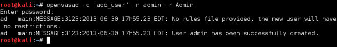

9.  执行下列命令：

    ```
    openvas-adduser
    ```

    这会让你创建普通用户：

    1.  输入登录名称。

    2.  在校验请求上按下回车键（这会自动选择密码）。

    3.  输入两次密码。

    4.  对于规则，按下`Ctrl + D`。

    5.  按下`Y`来添加用户。

    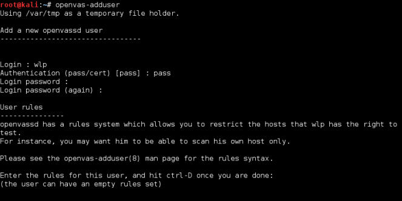

0.  执行下列命令来配置 OpenVAS 的交互端口：

    ```
    openvasmd -p 9390 -a 127.0.0.1
    openvasad -a 127.0.0.1 -p 9393
    gsad --http-only --listen=127.0.0.1 -p 9392
    ```

    > 9392 是用于 Web 浏览器的推荐端口，但是你可以自己选择。

1.  访问<http://127.0.0.1:9392>，在你的浏览器中查看 OpenVAS 的 Web 界面。

    

### 工作原理

在这个秘籍中，我们以打开终端窗口并通过仓库安装 OpenVAS 来开始。之后我们创建了一个证书并安装我们的插件数据库。然后，我们创建了一个管理员和一个普通用户账号。最后，我们启动了 OpenVAS 的 Web 界面并展示了登录界面。

> 每次你在 OpenVAS 中执行操作的时候，你都需要重建数据库。

### 更多

这一节展示了除了启动 OpenVAS 之外的一些附加信息。

**编写 SSH 脚本来启动 OpenVAS**

每次你打算启动 OpenVAS 的时候，你需要：

1.  同步 NVT 版本（这非常不错，因为这些项目会在新漏洞发现的时候更改）。

2.  启动 OpenVAS 扫描器。

3.  重建数据库。

4.  备份数据库。

5.  配置你的端口。

为了节省时间，下面的简单 Bash 脚本可以让你启动 OpenVAS。把文件保存为` OpenVAS.sh`，并放在你的`/root`文件夹中：

```sh
#!/bin/bash
openvas-nvt-sync
openvassd
openvasmd --rebuild
openvasmd --backup
openvasmd -p 9390 -a 127.0.0.1
openvasad -a 127.0.0.1 -p 9393
gsad --http-only --listen=127.0.0.1 -p 9392
```

**使用 OpenVAS 桌面**

你可以选择通过 OpenVAS 桌面来执行相同步骤。OpenVAS 桌面是一个 GUI 应用。为了启动这个应用：

1.  在 Kali Linux 的桌面的启动菜单中，访问`Applications | Kali Linux | Vulnerability Assessment | Vulnerability Scanners | OpenVAS | Start GreenBone Security Desktop`，就像下面展示的那样：

    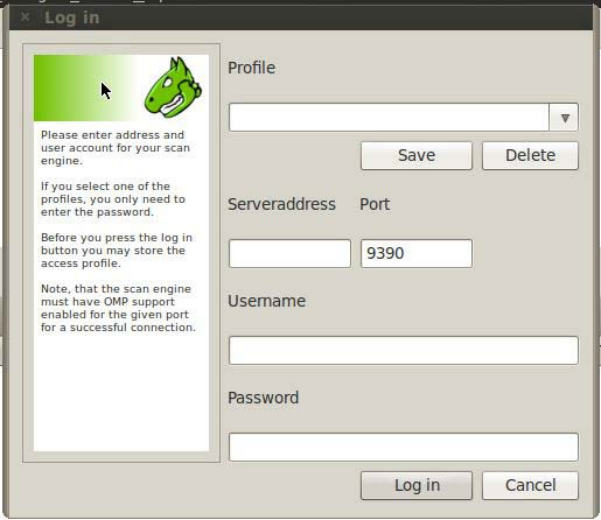

2.  将服务器地址输入为`127.0.0.1`。

3.  输入你的用户名。

4.  输入你的密码。

5.  点击`Log in`按钮。

## 5.7 OpenVAS - 发现本地漏洞

OpenVAS 允许我们攻击很多种类的漏洞，它们取决于我们的版本。我们也需要评估的目标漏洞列表限制为针对我们想要获取的信息类型的漏洞。在这个秘籍中，我们将要使用 OpenVAS 扫描目标上的本地漏洞，这些漏洞针对我们当前的本地主机。

### 操作步骤

让我们以使用 OpenVAS 发现本地漏洞开始，首先打开 Firefox 浏览器：

1.  访问<http://127.0.0.1:9392>并登陆 OpenVAS。

2.  访问` Configuration | Scan Configs`。

    

3.  输入扫描的名称。这个秘籍中，我们使用` Local Vulnerabilities`。

4.  我们选择`Empty, static and fast`选项。这个选项可以让我们从零开始并创建我们自己的配置。

5.  点击` Create Scan Config`：

    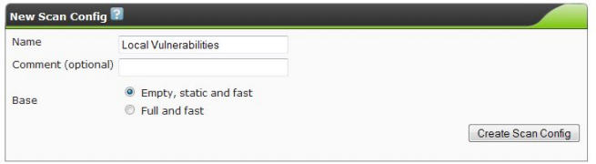

6.  我们现在打算编辑我们的扫描配置。点击` Local Vulnerabilities`旁边的扳手图标。

    

7.  按下`Ctrl + F`并在查找框中输入`Local`。

8.  对于每个找到的本地族，点击` Select all NVT's `框中的复选框。族是一组漏洞。选择的漏洞为：

    + `Compliance`
    + `Credentials`
    + `Default Accounts`
    + `Denial of Service`
    + `FTP`
    + `Ubuntu Local Security Checks`

    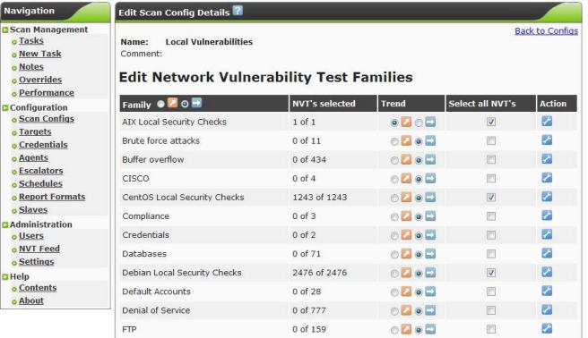

9.  点击`Save Config`。

0.  访问`Configuration | Targets`：

    

1.  创建新的目标并执行下列操作：

    1.  输入目标名称。

    2.  输入主机，通过下列方式之一：

        +   输入唯一的地址：`192.168.0.10 `

        +   输入多个地址，以逗号分隔：`192.168.0.10,192.168.0.115`

        +   输入地址范围：`192.168.0.1-20`

2.  点击` Create Target`。

3.  现在选择` Scan Management | New Task`，并执行下列操作：

    1.  输入任务名称。

    2.  输入注释（可选）。

    3.  选择你的扫描配置。这里是` Local Vulnerabilities`。

    4.  选择扫描目标。这里是`Local Network`。

    5.  所有其他选项保留默认。

    6.  点击` Create Task`。

    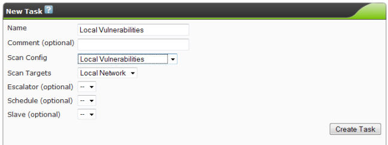

4.  现在访问` Scan Management | Tasks`。

5.  点击扫描旁边的播放按钮。这里是`Local Vulnerability Scan`：

    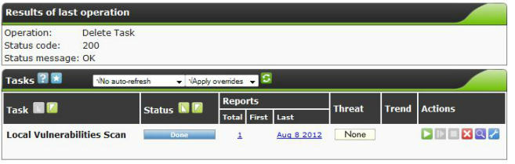

### 工作原理

这个秘籍中，我们启动 OpenVAS 并登入它的 Web 界面。之后我们配置了 OpenVAS 来搜索一系列本地漏洞。最后，我们选择了目标并完成了扫描。OpenVAS 之后扫描了目标系统上已知漏洞，包括我们的 NVT 版本。

### 更多

一旦执行了扫描，你可以通过查看报告来观察结果：

1.  访问` Scan Management | Tasks`。

2.  点击`Local Vulnerabilities Scan`旁边的放大镜图标：

    

3.  点击下载箭头来查看报告：

    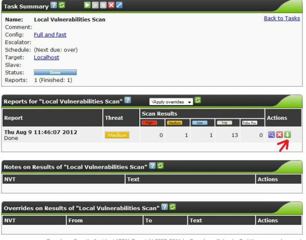

## 5.8 OpenVAS - 发现网络漏洞

在这个秘籍中，我们将要使用 OpenVAS 扫描目标上的网络漏洞，这些漏洞针对我们目标网络上的设备。

### 准备

为了完成这个秘籍，你需要被测试的虚拟机。

+ Windows XP
+ Windows 7
+ Metasploitable 2.0
+ 其它版本的 Linux

### 操作步骤

让我们以使用 OpenVAS 发现网络漏洞开始，首先打开 Firefox 浏览器：

1.  访问<http://127.0.0.1:9392>并登陆 OpenVAS。

2.  访问` Configuration | Scan Configs`。

    

3.  输入扫描的名称。这个秘籍中，我们使用` Network Vulnerabilities`。

4.  我们选择`Empty, static and fast`选项。这个选项可以让我们从零开始并创建我们自己的配置。

5.  点击` Create Scan Config`：

    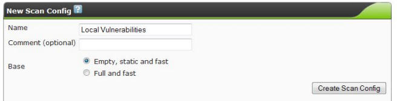

6.  我们现在打算编辑我们的扫描配置。点击` Network Vulnerabilities`旁边的扳手图标。

7.  按下`Ctrl + F`并在查找框中输入`Network `。

8.  对于每个找到的族，点击` Select all NVT's `框中的复选框。族是一组漏洞。选择的漏洞为：

    + `Brute force attacks`
    + `Buffer overflow`
    + `CISCO`
    + `Compliance`
    + `Credentials`
    + `Databases`
    + `Default Accounts`
    + `Denial of Service`
    + `FTP`
    + `Finger abuses`
    + `Firewalls`
    + `Gain a shell remotely`
    + `General`
    + `Malware`
    + `Netware`
    + `NMAP NSE`
    + `Peer-To-Peer File Sharing`
    + `Port Scanners`
    + `Privilege Escalation`
    + `Product Detection`
    + `RPC`
    + `Remote File Access`
    + `SMTP Problems`
    + `SNMP`
    + `Service detection`
    + `Settings`
    + `Wireless services`

    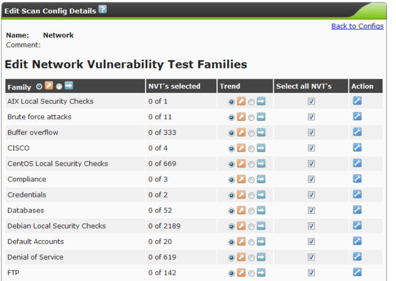

9.  点击`Save Config`。

0.  访问`Configuration | Targets`：

    

1.  创建新的目标并执行下列操作：

    1.  输入目标名称。

    2.  输入主机，通过下列方式之一：

        +   输入唯一的地址：`192.168.0.10 `

        +   输入多个地址，以逗号分隔：`192.168.0.10,192.168.0.115`

        +   输入地址范围：`192.168.0.1-20`

2.  点击` Create Target`。

3.  现在选择` Scan Management | New Task`，并执行下列操作：

    1.  输入任务名称。

    2.  输入注释（可选）。

    3.  选择你的扫描配置。这里是` Network Vulnerabilities`。

    4.  选择扫描目标。这里是`Local Network`。

    5.  所有其他选项保留默认。

    6.  点击` Create Task`。

    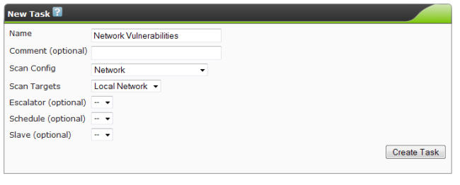

4.  现在访问` Scan Management | Tasks`。

5.  点击扫描旁边的播放按钮。这里是`Network Vulnerability Scan`：

### 工作原理

这个秘籍中，我们启动 OpenVAS 并登入它的 Web 界面。之后我们配置了 OpenVAS 来搜索一系列网络漏洞。最后，我们选择了目标并完成了扫描。OpenVAS 之后扫描了目标系统上已知漏洞，包括我们的 NVT 版本。

### 更多

一旦执行了扫描，你可以通过查看报告来观察结果：

1.  访问` Scan Management | Tasks`。

2.  点击`Network Vulnerabilities Scan`旁边的放大镜图标：

3.  点击下载箭头来查看报告：

    

## 5.9 OpenVAS - 发现 Linux 特定漏洞

在这个秘籍中，我们将要使用 OpenVAS 扫描 Linux 漏洞，这些漏洞针对我们目标网络上的 Linux 主机。

### 准备

为了完成这个秘籍，你需要被测试的虚拟机。

+ Metasploitable 2.0
+ 其它版本的 Linux

### 操作步骤

让我们以使用 OpenVAS 发现 Linux 特定漏洞开始，首先打开 Firefox 浏览器：

1.  访问<http://127.0.0.1:9392>并登陆 OpenVAS。

2.  访问` Configuration | Scan Configs`。

    

3.  输入扫描的名称。这个秘籍中，我们使用`Linux Vulnerabilities`。

4.  我们选择`Empty, static and fast`选项。这个选项可以让我们从零开始并创建我们自己的配置。

5.  点击` Create Scan Config`：

    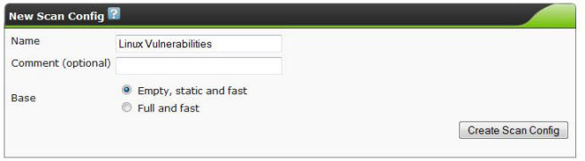

6.  我们现在打算编辑我们的扫描配置。点击`Linux Vulnerabilities`旁边的扳手图标。

7.  按下`Ctrl + F`并在查找框中输入`Linux`。

8.  对于每个找到的族，点击` Select all NVT's `框中的复选框。族是一组漏洞。选择的漏洞为：

    + `Brute force attacks`
    + `Buffer overflow`
    + `Compliance`
    + `Credentials`
    + `Databases`
    + `Default Accounts`
    + `Denial of Service`
    + `FTP`
    + `Finger abuses`
    + `Gain a shell remotely`
    + `General`
    + `Malware`
    + `Netware`
    + `NMAP NSE`
    + `Port Scanners`
    + `Privilege Escalation`
    + `Product Detection`
    + `RPC`
    + `Remote File Access`
    + `SMTP Problems`
    + `SNMP`
    + `Service detection`
    + `Settings`
    + `Wireless services`
    + `Web Server`

    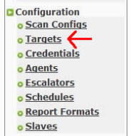

9.  点击`Save Config`。

0.  访问`Configuration | Targets`：

1.  创建新的目标并执行下列操作：

    1.  输入目标名称。

    2.  输入主机，通过下列方式之一：

        +   输入唯一的地址：`192.168.0.10 `

        +   输入多个地址，以逗号分隔：`192.168.0.10,192.168.0.115`

        +   输入地址范围：`192.168.0.1-20`

2.  点击` Create Target`。

3.  现在选择` Scan Management | New Task`，并执行下列操作：

    1.  输入任务名称。

    2.  输入注释（可选）。

    3.  选择你的扫描配置。这里是`Linux Vulnerabilities`。

    4.  选择扫描目标。这里是`Local Network`。

    5.  所有其他选项保留默认。

    6.  点击` Create Task`。

    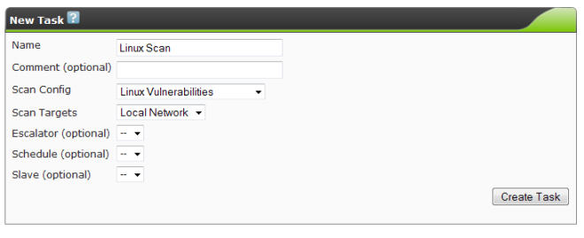

4.  现在访问` Scan Management | Tasks`。

5.  点击扫描旁边的播放按钮。这里是`Linux Vulnerability Scan`：

### 工作原理

这个秘籍中，我们启动 OpenVAS 并登入它的 Web 界面。之后我们配置了 OpenVAS 来搜索一系列 Linux 漏洞。最后，我们选择了目标并完成了扫描。OpenVAS 之后扫描了目标系统上已知漏洞，包括我们的 NVT 版本。

### 更多

一旦执行了扫描，你可以通过查看报告来观察结果：

1.  访问` Scan Management | Tasks`。

2.  点击`Linux Vulnerabilities Scan`旁边的放大镜图标：

3.  点击下载箭头来查看报告：

    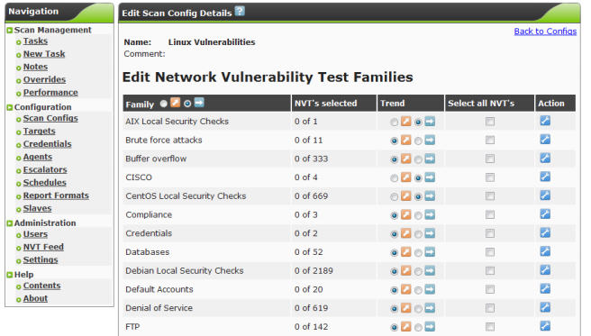

## 5.10 OpenVAS - 发现 Windows 特定漏洞

在这个秘籍中，我们将要使用 OpenVAS 扫描 Windows 漏洞，这些漏洞针对我们目标网络上的 Windows 主机。

### 准备

为了完成这个秘籍，你需要被测试的虚拟机。

+ Windows XP
+ Windows 7

### 操作步骤

让我们以使用 OpenVAS 发现 Windows 特定漏洞开始，首先打开 Firefox 浏览器：

1.  访问<http://127.0.0.1:9392>并登陆 OpenVAS。

2.  访问` Configuration | Scan Configs`。

    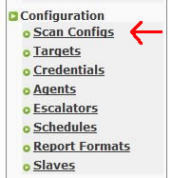

3.  输入扫描的名称。这个秘籍中，我们使用`Windows Vulnerabilities`。

4.  我们选择`Empty, static and fast`选项。这个选项可以让我们从零开始并创建我们自己的配置。

5.  点击` Create Scan Config`：

    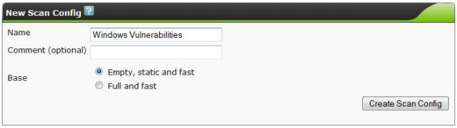

6.  我们现在打算编辑我们的扫描配置。点击`Windows Vulnerabilities`旁边的扳手图标。

7.  按下`Ctrl + F`并在查找框中输入`Windows`。

8.  对于每个找到的族，点击` Select all NVT's `框中的复选框。族是一组漏洞。选择的漏洞为：

    + `Brute force attacks`
    + `Buffer overflow`
    + `Compliance`
    + `Credentials`
    + `Databases`
    + `Default Accounts`
    + `Denial of Service`
    + `FTP`
    + `Gain a shell remotely`
    + `General`
    + `Malware`
    + `NMAP NSE`
    + `Port Scanners`
    + `Privilege Escalation`
    + `Product Detection`
    + `RPC`
    + `Remote File Access`
    + `SMTP Problems`
    + `SNMP`
    + `Service detection`
    + `Web Server`
    + `Windows`
    + `Windows: Microsoft Bulletins`

    

9.  点击`Save Config`。

0.  访问`Configuration | Targets`：

    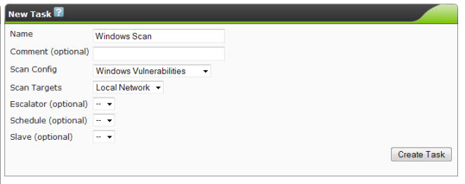

1.  创建新的目标并执行下列操作：

    1.  输入目标名称。

    2.  输入主机，通过下列方式之一：

        +   输入唯一的地址：`192.168.0.10 `

        +   输入多个地址，以逗号分隔：`192.168.0.10,192.168.0.115`

        +   输入地址范围：`192.168.0.1-20`

2.  点击` Create Target`。

3.  现在选择` Scan Management | New Task`，并执行下列操作：

    1.  输入任务名称。

    2.  输入注释（可选）。

    3.  选择你的扫描配置。这里是`Windows Vulnerabilities`。

    4.  选择扫描目标。这里是`Local Network`。

    5.  所有其他选项保留默认。

    6.  点击` Create Task`。

    

4.  现在访问` Scan Management | Tasks`。

5.  点击扫描旁边的播放按钮。这里是`Windows Vulnerability Scan`：

### 工作原理

这个秘籍中，我们启动 OpenVAS 并登入它的 Web 界面。之后我们配置了 OpenVAS 来搜索一系列 Windows 漏洞。最后，我们选择了目标并完成了扫描。OpenVAS 之后扫描了目标系统上已知漏洞，包括我们的 NVT 版本。

### 更多

一旦执行了扫描，你可以通过查看报告来观察结果：

1.  访问` Scan Management | Tasks`。

2.  点击`Windows Vulnerabilities Scan`旁边的放大镜图标：

3.  点击下载箭头来查看报告：

    
