# 第八章 密码攻击

> 作者：Willie L. Pritchett, David De Smet

> 译者：[飞龙](https://github.com/)

> 协议：[CC BY-NC-SA 4.0](http://creativecommons.org/licenses/by-nc-sa/4.0/)

这一章中，我们要探索一些攻击密码来获得用户账户的方式。密码破解是所有渗透测试者都需要执行的任务。本质上，任何系统的最不安全的部分就是由用户提交的密码。无论密码策略如何，人们必然讨厌输入强密码，或者时常更新它们。这会使它们易于成为黑客的目标。

## 8.1 在线密码攻击

这个秘籍中我们会使用 Hydra 密码破解器。有时候我们有机会来物理攻击基于 Windows 的计算机，直接获取安全账户管理器（SAM）。但是，我们也有时不能这样做，所以这是在线密码攻击具有优势的情况。

Hydra 支持许多协议，包括（但不仅限于）FTP、HTTP、HTTPS、MySQL、MSSQL、Oracle、Cisco、IMAP、VNC 和更多的协议。需要注意的是，由于这种攻击可能会产生噪声，这会增加你被侦测到的可能。

### 准备

需要内部网络或互联网的链接，也需要一台用作受害者的计算机。

### 操作步骤

让我们开始破解在线密码。

1.  在开始菜单中，选择` Applications | Kali Linux | Password Attacks | Online Attacks | hydra-gtk`。

    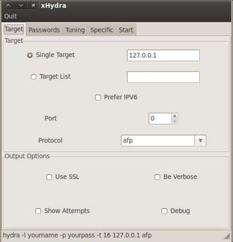
    
2.  既然我们已经把 Hydra 打开了，我们需要设置我们的单词列表。点击`Passwords`（密码）标签页。我们需要使用用户名列表和密码列表。输入你的用户名和密码列表的位置。同时选择` Loop around users `（循环使用用户名）和` Try  empty password`（尝试空密码）。

    +   用户名列表：`/usr/share/wfuzz/wordlist/fuzzdb/wordlistsuser-passwd/names/nameslist.txt`
    +   密码列表：`/usr/share/wfuzz/wordlist/fuzzdb/wordlistsuser-passwd/passwds/john.txt`
    
    > 你可以使用的快捷方式是，点击单词列表框来打开文件系统窗口。
    
    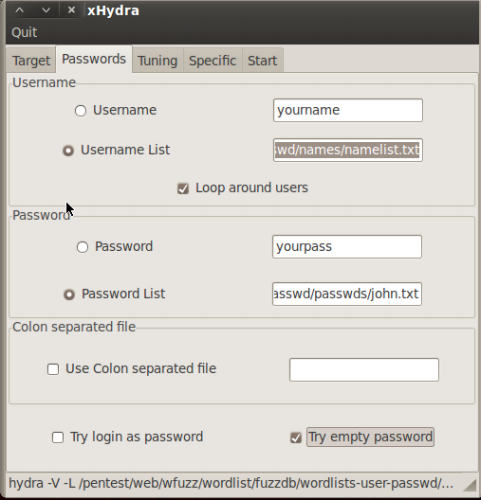
    
3.  下面，我们要做一些调整。在`Performance Options`（执行选项）下面，我们将任务数量从 16 设置为 2。原因是我们不打算让这么多进程运行，这样会使服务器崩溃。虽然它是可选的，我们也希望选择`Exit after first found pair `（在首次发现匹配之后退出）选项。

    
    
4.  最后，我们要设置我们的目标。点击`Target`（目标）标签页并设置我们的目标和协议。这里，我们使用 Metasploitable 主机（`192.168.10.111`）的 MySQL 端口。

    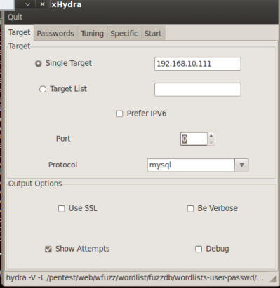

5.  最后我们点击`Start`（开始）标签页的`Start`按钮来启动攻击。

    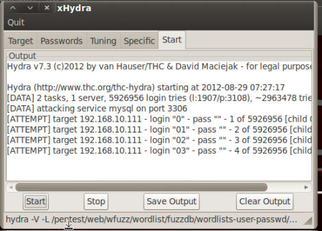
    
### 工作原理

这个秘籍中，我们使用 Hydra 来对目标执行字典攻击。Hydra 允许我们指定目标，并且使用用户名和密码列表。它会通过使用来自两个列表的不同用户名和密码组合来爆破密码。

## 8.2 破解 HTTP 密码

这个秘籍中，我们将要使用 Hydra 密码破解器来破解 HTTP 密码。网站和 Web 应用的访问通常由用户名和密码组合来控制。就像任何密码类型那样，用户通常会输入弱密码。

### 准备

需要内部网络或互联网的链接，也需要一台用作受害者的计算机。

### 操作步骤

让我们开始破解 HTTP 密码。

1.  在开始菜单中，选择` Applications | Kali Linux | Password Attacks | Online Attacks | hydra-gtk`。

    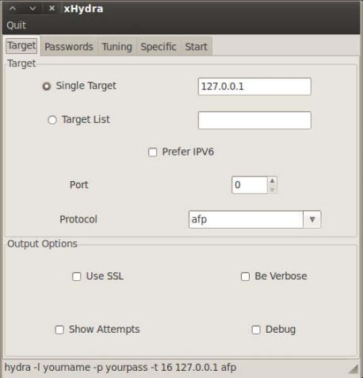
    
2.  既然我们已经把 Hydra 打开了，我们需要设置我们的单词列表。点击`Passwords`（密码）标签页。我们需要使用用户名列表和密码列表。输入你的用户名和密码列表的位置。同时选择` Loop around users `（循环使用用户名）和` Try  empty password`（尝试空密码）。

    +   用户名列表：`/usr/share/wfuzz/wordlist/fuzzdb/wordlistsuser-passwd/names/nameslist.txt`
    +   密码列表：`/usr/share/wfuzz/wordlist/fuzzdb/wordlistsuser-passwd/passwds/john.txt`
    
    > 你可以使用的快捷方式是，点击单词列表框来打开文件系统窗口。
    
    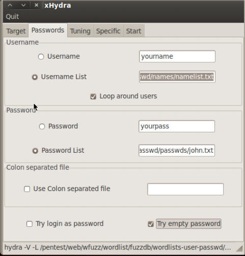
    
3.  下面，我们要做一些调整。在`Performance Options`（执行选项）下面，我们将任务数量从 16 设置为 2。原因是我们不打算让这么多进程运行，这样会使服务器崩溃。虽然它是可选的，我们也希望选择`Exit after first found pair `（在首次发现匹配之后退出）选项。

    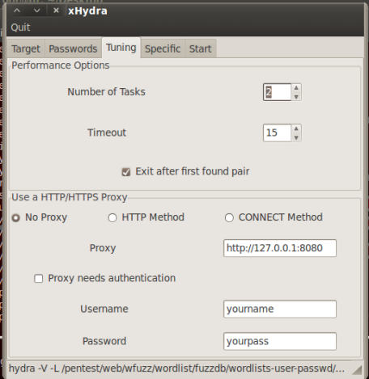
    
4.  最后，我们要设置我们的目标。点击`Target`（目标）标签页并设置我们的目标和协议。这里，我们使用 Metasploitable 主机（`192.168.10.111`）的 HTTP 端口。

    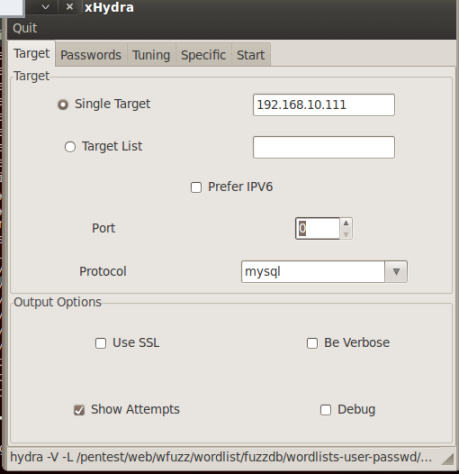

5.  最后我们点击`Start`（开始）标签页的`Start`按钮来启动攻击。

    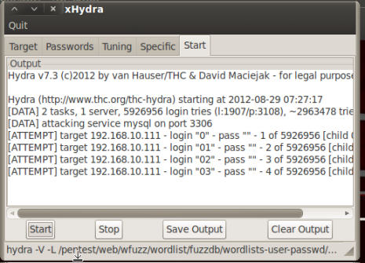

## 8.3 获得路由访问

这个秘籍中，我们会使用 Medusa 来进行爆破攻击。

当今，我们处于网络社会之中。随着联网视频游戏系统的诞生，多数家庭拥有数台计算机，并且小型业务以创纪录的趋势增长。路由器也成为了网络连接的基石。然而，富有经验的网络管理员的数量并没有增长，以保护这些路由器，使得许多这种路由器易于被攻击。

### 准备

需要连接到互联网或内部网络的计算机。也需要可用的路由器。

### 操作步骤

1.  在开始菜单中，访问` Applications | Kali Linux | Password Attacks | Online Attacks | medusa`。当 Medusa 启动后，它会加载`help`（帮助）文件。

    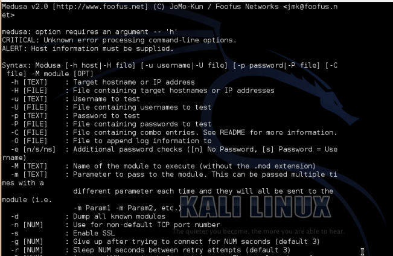

2.  我们现在已选定的选项来云顶 Medusa。

    ```
    medusa –M http -h 192.168.10.1 -u admin -P /usr/share/wfuzz/ wordlist/fuzzdb/wordlists-user-passwd/passwds/john.txt -e ns -n 80 -F
    ```
    
    +   `-M http`允许我们指定模块。这里，我们选择了 HTTP 模块。
    
    +   `-h 192.168.10.1`允许我们指定主机。这里，我们选择了`192.168.10.1`（路由的 IP 地址）。
    
    +   `-u admin`允许我们指定用户。这里我们选择了`admin`。
    
    +   `-P [location of password list]`允许我们指定密码列表的位置。
    
    +   `-e ns`允许我们指定额外的密码检查。`ns`变量允许我们使用用户名作为密码，并且使用空密码。
    
    +   `-n 80`允许我们指定端口号码。这里我们选择了`80`。
    
    +   `-F`允许我们在成功找到用户名密码组合之后停止爆破。
    
    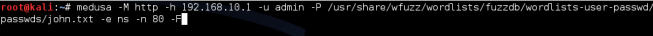
    
3.  Medusa 会运行，并尝试所有用户名和密码组合，直到某次成功。

### 工作原理

这个秘籍中，我们使用 Medusa 来爆破目标路由器的密码。能够这样做的好处就是，一旦你能够访问路由器，你就可以更新它的设置，便于你以后再访问它，或者甚至是重定向发送给它的流量来改变你选择的位置。

### 更多

你也可以直接从命令行运行 Medusa，通过键入`medusa`命令。

你也可以传入其它选项给 Medusa，取决于你的情况。细节请参见帮助文档，通过在终端窗口仅仅键入`medusa`来显示。

**模块类型**

下面是我们可以用于 Medusa 的模块列表：

+ AFP
+ CVS
+ FTP
+ HTTP
+ IMAP
+ MS-SQL
+ MySQL
+ NetWare
+ NNTP
+ PCAnywhere
+ Pop3
+ PostgreSQL
+ REXEC
+ RLOGIN
+ RSH
+ SMBNT
+ SMTP-AUTH
+ SMTp-VRFY
+ SNMP
+ SSHv2
+ Subversion
+ Telnet
+ VMware Authentication
+ VNC
+ Generic Wrapper
+ Web form

## 8.4 密码分析

这个秘籍中，我们会学到如何在密码攻击之前分析密码。密码分析的目的是允许我们通过收集目标机器、业务以及其它的信息来得到更小的单词列表。在我们的教程中，我们会使用 Ettercap 和 它的 ARP 毒化功能来嗅探流量。

### 准备

这个秘籍需要局域网的连接。

### 操作步骤

让我们启动 Ettercap 来进行密码分析。

1.  我们以配置 Ettercap 来开始这个秘籍。首先，我们找到它的配置文件并用 VIM 编辑它。

    ```
    locate etter.conf 
    vi /etc/etterconf
    ```
    
    要注意，你的位置可能不同。

2.  将`ec_uid`和`ec_gid`改为`0`。

    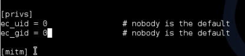

3.  下面我们需要取消下面的 IPTABLES 行的注释。它在靠近文件末尾的` LINUX `一节。

    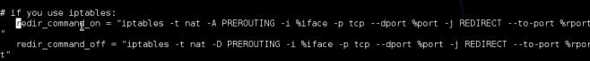
    
4.  现在，我们将要启动 Ettercap。使用`-G`选项，加载图形化界面（GUI）。

    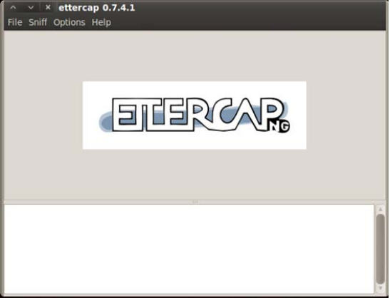

5.  我们开启统一嗅探。你可以按下`Shift + U`或者访问菜单栏中的`Sniff | Unified sniffing...`。

    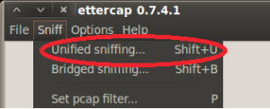

6.  选择网络接口。

    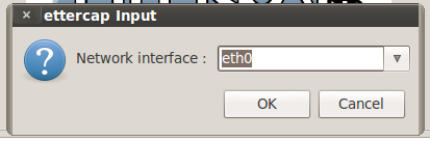

7.  下面，我们开始`Scan for hosts`（扫描主机），这可以通过按下`Ctrl + S`或访问菜单栏的`Hosts | Scan for hosts`来完成。

    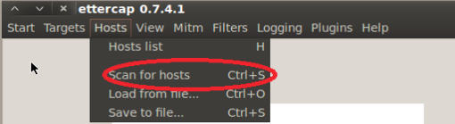

8.  现在我们能够让 Ettercap 开始嗅探了。你可以按下`Ctrl + W`或访问菜单栏的`Start | Start Sniffing`（开始嗅探）。

    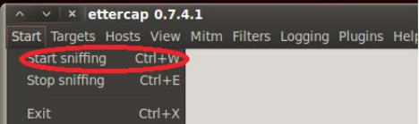

9.  最后，我们开始进行 ARP 毒化。访问菜单栏的`Mitm | Arp poisoning`（ARP 毒化）。

    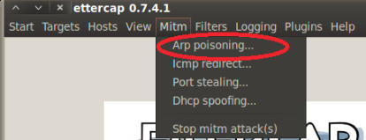

0.  在出现的窗口中，选中`Sniff  remote connections`（嗅探远程连接）的选项。

    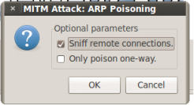

1.  取决于网络情况，我们会看到信息。

    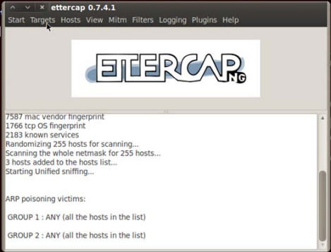

2.  一旦我们找到了我们想找的信息（用户名和密码）。我们会关闭 Ettercap。你可以按下`Ctrl + E`或者访问菜单栏的` Start | Stop sniffing`（停止嗅探）来完成。

    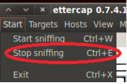
    
3.  现在我们需要关闭 ARP 毒化来使网络恢复正常。

    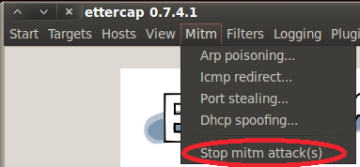

### 工作原理

这个秘籍中，我们使用 Ettercap 来毒化网络并偷取网络上的用户名和密码。我们以寻找和修改 Ettercap 的配置文件来开始。之后我们启动了 Ettercap 并使用 ARP 毒化执行中间人（MITM）攻击。由于流量被重定向到我们的主机，当用户名和密码在网络上传播时，我们就能够看到它们。

### 更多

我们也可以使用  Metasploit 来分析用户名和面。我们会通过使用搜索邮件收集器模块来执行它。

1.  打开终端窗口并启动  MSFCONSOLE：

    ```
    msfconsole
    ```
    
2.  搜索邮件收集器；

    ```
    search email collector
    ```

    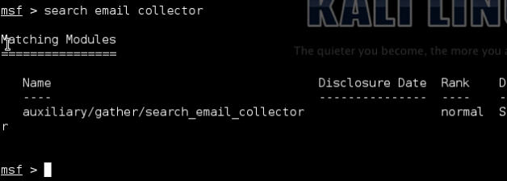

3.  键入下列命令来使用搜索邮件收集器模块：

    ```
    use auxiliary/gather/search_email_collector 
    ```
    
4.  展示该模块可用的选项：

    ```
    show options
    ```

    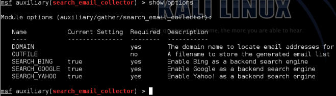
    
5.  下面我们设置域名。如果不想被有关部门查水表的话，请小心选择域名。

6.  将域名设为你希望的域名：

    ```
    set domain  gmail.com
    ```
    
7.  设置输入文件。这并不是必需的。如果你打算运行多个攻击，或打算稍后也能运行某个攻击，推荐设置它。

    ```
    set outfile /root/Desktop/fromwillie.txt
    ```
    
    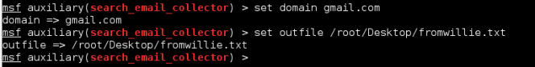
    
8.  最后，我们开始攻击。

    ```
    run
    ```

    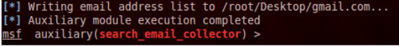

## 8.5 使用 John the Ripper 破解 Windows 密码

这个秘籍中，我们会使用 John the Ripper 来破解 Windows 安全访问管理器（SAM）文件。SAM文件储存了目标系统用户的用户名和密码的哈希。出于安全因素，SAM文件使用授权来保护，并且不能在 Windows 系统运行中直接手动打开或复制。

### 准备

你将会需要访问 SAM 文件。

这个秘籍中，我们假设你能够访问某台 Windows 主机。

### 操作步骤

让我们开始使用 John the Ripper 破解 Windows SAM 文件。我们假设你能够访问某台 Windows 主机，通过远程入侵，或者物理接触，并且能够通过 USB 或 DVD 驱动器启动 Kali Linux。

1.  看看你想挂载哪个硬盘：

    ```
    Fdisk -l
    ```
    
2.  挂载该硬盘，并将`target`设为它的挂载点。

    ```
    mount /dev/sda1 /target/ 
    ```
    
3.  将目录改为 Windows SAM 文件的位置：

    ```
    cd /target/windows/system32/config 
    ```
    
4.  列出目录中所有内容。

    ```
    ls –al
    ```
    
5.  使用 SamDump2 来提取哈希，并将文件放到你的 root 用户目录中的一个叫做`hashes`的文件夹中。

    ```
    samdump2 system SAM > /root/hashes/hash.txt
    ```
    
6.  将目录改为 John the Ripper 所在目录。

7.  运行 John the Ripper：

    ```
    ./john /root/hashes/hash.txt 
    ./john /root/hashes/hash.txt–f:nt  (If attacking a file on a NTFS System) 
    ```
    
## 8.6 字典攻击

这个秘籍中，我们会进行字典或单词列表的攻击。字典攻击使用事先准备的密码集合，并尝试使用单词列表爆破与指定用户匹配的密码。所生成的字典通常由三种类型：

    +   只有用户名：列表只含有用户名。
    +   只有密码：列表只含有密码。
    +   用户名和密码：列表含有生成的用户名和密码。
    
出于演示目的，我们使用 Crucnch 来生成我们自己的密码字典。

### 准备

需要在 Kali 上安装 Crunch。

### 操作步骤

Kali 的好处是已经安装了 Crunch，不像 BackTrack。

1.  打开终端窗口，并输入`crunch`命令来查看 Crunch 的帮助文件。

    ```
    crunch
    ```
    
    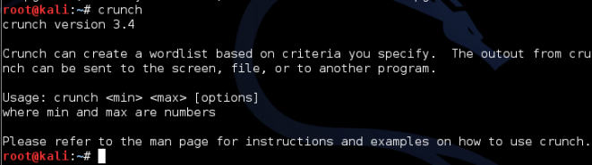
    
2.  使用 Crunch 生成密码的基本语法是，`[minimum length] [maximum length] [character set] [options] `。

3.  Crunch 拥有几种备选选项。一些常用的如下：

    +   `-o`：这个选项允许你指定输出列表的文件名称和位置、
    
    +   `-b`：这个选项允许你指定每个文件的最大字节数。大小可以以 KB/MB/GB 来指定，并且必须和`-o START`触发器一起使用。
    
    +   `-t`：这个选项允许你指定所使用的模式。
    
    +   `-l`：在使用`-t`选项时，这个选项允许你将一些字符标识为占位符（`@`，`%`，`^`）。
    
4.  下面我们执行命令来在桌面上创建密码列表，它最少 8 个字母，最大 10 个字符，并且使用字符集`ABCDEFGabcdefg0123456789`。

    ```
    crunch 8 10 ABCDEFGabcdefg0123456789 –o /root/Desktop/ generatedCrunch.txt
    ```
    
    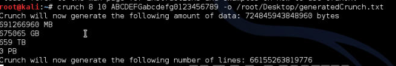
    
5.  一旦生成了文件，我们使用 Nano 来打开文件：

    ```
    nano /root/Desktop/generatedCrunch.txt
    ```
    
### 工作原理

这个秘籍中我们使用了 Crunch 来生成密码字典列表。

## 8.7 使用彩虹表

这个秘籍中我们会学到如何在 Kali 中使用彩虹表。彩虹表是特殊字典表，它使用哈希值代替了标准的字典密码来完成攻击。出于演示目的，我们使用 RainbowCrack 来生成彩虹表。

### 操作步骤

1.  打开终端窗口并将目录改为`rtgen`的目录：

    ```
    cd /usr/share/rainbowcrack/
    ```
    
    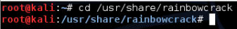
    
2.  下面我们要启动`rtgen`来生成基于 MD5 的彩虹表。

    ```
    ./rtgen md5 loweralpha-numeric 1 5 0 3800 33554432 0
    ```
    
    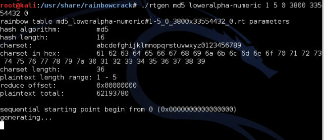
    
3.  一旦彩虹表生成完毕，你的目录会包含`.rt`文件。这取决于用于生成哈希的处理器数量，大约需要 2~7 个小时。

4.  为了开始破解密码，我们使用`rtsort`程序对彩虹表排序，使其更加易于使用。

### 工作原理

这个秘籍中，我们使用了 RainbowCrack  攻击来生成、排序和破解 MD5 密码。RainbowCrack 能够使用彩虹表破解哈希，基于一些预先准备的哈希值。我们以使用小写字母值生成 MD5 彩虹表来开始。在秘籍的末尾，我们成功创建了彩虹表，并使用它来破解哈希文件。

## 8.8 使用英伟达统一计算设备架构（CUDA）

这个秘籍中，我们会使用英伟达统一计算设备架构（CUDA）来破解密码哈希。CUDA 是一个并行计算平台，它通过利用 GPU 的能力来提升计算性能。随着时间的流逝，GPU 的处理能力有了戏剧性的提升，这让我们能够将它用于计算目的。出于演示目的，我们使用  CudaHashcat-plus 来破解密码。

### 准备

需要 CUDA 所支持的显卡来完成这个秘籍。

### 操作步骤

1.  打开终端窗口并将目录改为  OclHashcat-plus 所在目录。

    ```
    cd /usr/share/oclhashcat-plus
    ```
    
    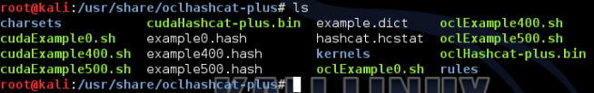
    
2.  执行下列命令来启动  CudaHashcat-plus 的帮助文件：

    ```
    ./cudaHashcat-plus.bin –help 
    ```
    
3.  运行 CudaHashcat 的语法是`cudaHashcat-plus.bin [options] hash [mask]`。

    > 使用  OclHashcat 的重点之一是理解它的字符集结构。
    
4.  在我们开始攻击之前，让我们先看看一些可用的攻击向量。CudaHashcat 在攻击中使用左右掩码。密码的字符按照掩码划分，并且被均分为左和右掩码。对于每个掩码，你可以为其指定字典或字符集。出于我们的目的，我们会使用定制的字符集。

5.  为了指定自定义字符集，我们使用`–1`选项。我们可以设置任意多的自定义字符集，只要为它们指定一个数值（`1-n`）。每个自定义字符都由问号（`?`）来表示，并且随后是字符类型。可用的选择是：

    +   `d`指定数字（0~9）
    +   `l`指定小写字母
    +   `u`指定大写字母
    +   `s`指定特殊字符
    +   `1-n`指定用做占位符的自定义字符集。
    
6.  这样将它们组合起来，我们就指定了一个自定义字符集，它包括特殊字符（`s`），大写字母（`u`），小写字母（`l`）和数字（`d`），生成长度为 8 的密码。我们打算指定叫做`attackfile`的哈希表。

    ```
    ./cudaHashcat-plus.bin attackfile -1 ?l?u?d?s ?1?1?1?1 ?1?1?1?1
    ```
    
7.  我们可以将这个命令这样拆分：

    +   ` ./cudaHashcat-plus.bin `调用了 CudaHashcat 。
    
    +   `attackfile`是我们的攻击文件。
    
    +   `-1 ?l?u?d?`指定了自定义字符集`1`，它包含小写字母、大写字母、数字和特殊字符。
    
    +   `?1?1?1?1`是使用字符集`1`的左掩码。
    
    +   `?1?1?1?1`是使用字符集`1`的右掩码。
    
    这就结束了。

## 8.9 使用 ATI Stream

这个秘籍中，我们会使用 ATI Stream 来破解密码哈希。ATI Stream 类似于 CUDA，因为它是一个并行计算平台，它可以通过利用 GPU 的能力来提升计算性能。随着时间的流逝，GPU 的处理能力有了戏剧性的提升，这让我们能够将它用于计算目的。出于演示目的，我们使用  OclHashcat-plus 来破解密码。OclHashcat 有两种版本：plus 和 lite。两个都包含在 Kali 中。

### 准备

需要支持 ATI Stream 的显卡来完成这个秘籍。

### 操作步骤

让我们开始使用 OclHashcat-plus。

1.  打开终端窗口并将目录改为  OclHashcat-plus 所在目录。

    ```
    cd /usr/share/oclhashcat-plus
    ```
    
    
    
2.  执行下列命令来启动  OclHashcat-plus 的帮助文件：

    ```
    ./oclHashcat-plus.bin –help 
    ```
    
3.  运行 OclHashcat 的语法是`oclHashcat-plus.bin [options] hash [mask]`。

    > 使用  OclHashcat 的重点之一是理解它的字符集结构。
    
4.  在我们开始攻击之前，让我们先看看一些可用的攻击向量。OclHashcat 在攻击中使用左右掩码。密码的字符按照掩码划分，并且被均分为左和右掩码。对于每个掩码，你可以为其指定字典或字符集。出于我们的目的，我们会使用定制的字符集。

5.  为了指定自定义字符集，我们使用`–1`选项。我们可以设置任意多的自定义字符集，只要为它们指定一个数值（`1-n`）。每个自定义字符都由问号（`?`）来表示，并且随后是字符类型。可用的选择是：

    +   `d`指定数字（0~9）
    +   `l`指定小写字母
    +   `u`指定大写字母
    +   `s`指定特殊字符
    +   `1-n`指定用做占位符的自定义字符集。
    
6.  这样将它们组合起来，我们就指定了一个自定义字符集，它包括特殊字符（`s`），大写字母（`u`），小写字母（`l`）和数字（`d`），生成长度为 8 的密码。我们打算指定叫做`attackfile`的哈希表。

    ```
    ./oclHashcat-plus.bin attackfile -1 ?l?u?d?s ?1?1?1?1 ?1?1?1?1
    ```
    
7.  我们可以将这个命令这样拆分：

    +   ` ./oclHashcat-plus.bin `调用了 OclHashcat 。
    
    +   `attackfile`是我们的攻击文件。
    
    +   `-1 ?l?u?d?`指定了自定义字符集`1`，它包含小写字母、大写字母、数字和特殊字符。
    
    +   `?1?1?1?1`是使用字符集`1`的左掩码。
    
    +   `?1?1?1?1`是使用字符集`1`的右掩码。
    
    这就结束了。
    
## 8.10 物理访问攻击

这个秘籍中，我们会使用 SUCrack 来执行物理访问密码攻击。 SUCrack 是个多线程的工具，能够通过`su`来执行本地用户账户的暴力破解。Linux 的`su`命令允许你作为替代用户来运行命令。这个攻击，虽然在你不能通过其他手段提权 Linux 系统时非常有用，但是会填满日志文件，所以请确保在完成之后清理这些日志。

SUCrack 拥有几种备选的可用命令：

+   `--help`允许你查看它的帮助文档。

+   `-l`允许你修改我们尝试绕过登录的用户。

+   `-s`允许你设置展示统计信息的秒数间隔。默认值为 3 秒。

+   `-a`允许你设置是否使用 ANSI 转义代码。

+   `-w`允许你设置工作线程的数量。由于 SUCrack 是多线程的，你可以运行任意多的线程。我们推荐你只使用一个线程，因为每次失败的登录尝试在尝试下个密码之前通常有三秒的延迟。

### 操作步骤

1.  为了使用 SUCrack，你需要在启动时指定单词列表。否则，你会得到一条搞笑的信息。打开终端窗口并执行`sucrack`命令。出于我们的目的，我们会使用之前创建的自定义单词列表文件，它由 Crunch 生成。但是，你可以指定任何希望的单词列表。

    ```
    sucrack /usr/share/wordlists/rockyou.txt
    ```
    
2.  如果你打算设置两个工作线程，以及每 6 秒显示一次统计信息，并且使用 ANSI 转义代码，你可以使用下列命令：

    ```
    sucrack –w 2 –s 6 –a /usr/share/wordlists/rockyou.txt 
    ```
    
    这就结束了。
    
### 工作原理

这个秘籍中，我们使用 SUCrack 来对系统的 root 用户执行物理访问密码攻击。使用单词列表的攻击可以对管理员（默认）或特定用户指定。我们运行`sucrack`命令，它为我们执行攻击。
