# 第九章 无线攻击

> 作者：Willie L. Pritchett, David De Smet

> 译者：[飞龙](https://github.com/)

> 协议：[CC BY-NC-SA 4.0](http://creativecommons.org/licenses/by-nc-sa/4.0/)

## 简介

当今，无线网络随处可见。由于用户四处奔走，插入以太网网线来获取互联网访问的方式非常不方便。无线网络为了使用便利要付出一些代价；它并不像以太网连接那样安全。这一章中，我们会探索多种方式来操纵无线网络流量，这包括移动电话和无线网络。

### 9.1 WEP 无线网络破解

WEP（无线等效协议）于 1999 年诞生，并且是用于无线网络的最古老的安全标准。在 2003 年，WEP 被 WPA 以及之后被 WPA2 取代。由于可以使用更加安全的协议，WEP 加密很少使用了。实际上，推荐你永远不要使用 WEP 加密来保护你的网络。有许多已知的方式来攻击 WEP 加密，并且我们在这个秘籍中会探索这些方式之一。

这个秘籍中，我们会使用 AirCrack 套件来破解 WEP 密码。 AirCrack 套件（或 AirCrack NG）是 WEP 和 WPA 密码破解程序，它会抓取无线网络封包，分析它们，使用这些数据来破解 WEP 密码。

### 准备

为了执行这个秘籍中的任务，需要Kali 终端窗口的经验。也需要受支持的配置好的无线网卡，用于封包注入。在无线网卡的例子中，封包注入涉及到发送封包，或将它注入到双方已经建立的连接中。请确保你的无线网卡允许封包注入，因为并不是所有无线网卡都支持它。

### 操作步骤

让我们开始使用 AirCrack 来破解WEP 加密的网络会话。

1.  打开终端窗口，并产生无线网络接口的列表：

    ```
    airmon-ng
    ```
    
    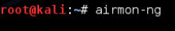
    
2.  在`interface`列下，选择你的接口之一。这里，我们使用`wlan0`。如果你的接口不同，例如`mon0`，请将每个提到`wlan0`的地方都换成它。

3.  下面，我们需要停止`wlan0`接口，并把它关闭，便于我们接下来修改 MAC 地址。

    ```
    airmon-ng stop 
    ifconfig wlan0 down
    ```
    
4.  下面，我们需要修改我们接口的 MAC 地址。由于机器的 MAC 地址会在任何网络上标识你的存在，修改机器的标识允许我们隐藏真正的 MAC 地址。这里，我们使用`00:11:22:33:44:55`。

    ```
    macchanger --mac 00:11:22:33:44:55 wlan0 
    ```
    
5.  现在我们需要重启` airmon-ng`。

    ```
    airmon-ng start wlan0
    ```
    
6.  下面，我们会使用` airodump`来定位附近的可用无线网络。

    ```
    airodump-ng wlan0 
    ```
    
7.  这会出现可用无线网络的列表。一旦你找到了你想要攻击的网络，按下`Ctrl + C`来停止搜索。选中`BSSID`列中的 MAC 地址，右击你的鼠标，并且选择复制。同时，把网络正在发送哪个频道的信号记录下载。你会在`Channel`列中找到这个信息。这里，这个频道是`10`。

8.  现在运行`airodump`，并且将所选`BSSID`的信息复制到文件中。我们会使用下列选项：

    +   `-c`允许我们选择频道。这里我们选择`10`。
    
    +   `-w`允许我们选择文件名称。这里我们选择`wirelessattack`。
    
    +   `-bssid`允许我们选择我们的`BSSID`。这里，我们从剪贴板上粘贴`09:AC:90:AB:78`。
    
    ```
    airodump-ng –c 10 –w wirelessattack --bssid 09:AC:90:AB:78 wlan0 
    ```
    
9.  新的窗口会打开，并展示这个命令的输出。保持这个窗口开着。

0.  打开另一个终端窗口，为了尝试组合它们，我们运行`aireplay`。它拥有下列语法：`aireplay-ng -1 0 –a [BSSID] –h [our chosen MAC address] –e [ESSID] [Interface]`。

    ```
    aireplay-ng -1 0 -a 09:AC:90:AB:78 –h 00:11:22:33:44:55 –e backtrack wlan0
    ```
    
1.  下面，我们发送一些流量给路由器，便于捕获一些数据。我们再次使用`aireplay`，以下列格式：` aireplay-ng -3 –b [BSSID] – h [Our chosen MAC address] [Interface]`。

    ```
    aireplay-ng -3 –b 09:AC:90:AB:78 –h 00:11:22:33:44:55 wlan0
    ```
    
2.  你的屏幕会开始被流量填满。将它运行一到两分钟，直到你拥有了用来执行破解的信息。

3.  最后我们运行 AirCrack 来破解 WEP 密码。

    ```
    aircrack-ng –b 09:AC:90:AB:78 wirelessattack.cap 
    ```
    
    这就结束了。
    
### 工作原理

在这个秘籍中，我们使用了 AirCrack 套件来破解无线网络的 WEP 密码。AirCrack 是最流行的 WEP 破解工具之一。AirCrack 通过收集 WEP 无线连接的封包来工作，之后它会通过算术分析数据来破解 WEP 加密密码。我们通过启动 AirCrack 并选择我们想要的接口来开始。下面，我们修改了 MAC 地址，这允许我们修改互联网上的身份，之后使用`airodump`搜索可用的无线网络来攻击。一旦我们找到了打算攻击的网络，我们使用`aireplay`来将我们的机器与正在攻击的无线设备的 MAC 地址关联。我们最后收集到了一些流量，之后暴力破解生成的 CAP 文件来获得无线密码。

## 5.2 WPA/WPA2 无线网络破解

WPA（无线保护访问）于 2003 年诞生，并且为保护无线网络和取代过时的旧标准 WEP 而创建。WEP 被 WPA 以及之后的 WPA2 代替。由于存在更加安全的协议，WEP 很少使用了。

这个秘籍中，我们会使用 AirCrack 套件来破解 WPA 密码。 AirCrack 套件（或 AirCrack NG）是 WEP 和 WPA 密码破解程序，它抓取网络封包，分析它们，并使用这些数据破解 WPA 密码。

### 准备

为了执行这个秘籍中的任务，需要Kali 终端窗口的经验。也需要受支持的配置好的无线网卡，用于封包注入。在无线网卡的例子中，封包注入涉及到发送封包，或将它注入到双方已经建立的连接中。

### 操作步骤

让我们开始使用 AirCrack 来破解WEP 加密的网络会话。

1.  打开终端窗口，并产生无线网络接口的列表：

    ```
    airmon-ng
    ```
    
    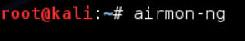
    
2.  在`interface`列下，选择你的接口之一。这里，我们使用`wlan0`。如果你的接口不同，例如`mon0`，请将每个提到`wlan0`的地方都换成它。

3.  下面，我们需要停止`wlan0`接口，并把它关闭，便于我们接下来修改 MAC 地址。

    ```
    airmon-ng stop 
    ifconfig wlan0 down
    ```
    
4.  下面，我们需要修改我们接口的 MAC 地址。由于机器的 MAC 地址会在任何网络上标识你的存在，修改机器的标识允许我们隐藏真正的 MAC 地址。这里，我们使用`00:11:22:33:44:55`。

    ```
    macchanger --mac 00:11:22:33:44:55 wlan0 
    ```
    
5.  现在我们需要重启` airmon-ng`。

    ```
    airmon-ng start wlan0
    ```
    
6.  下面，我们会使用` airodump`来定位附近的可用无线网络。

    ```
    airodump-ng wlan0 
    ```
    
7.  这会出现可用无线网络的列表。一旦你找到了你想要攻击的网络，按下`Ctrl + C`来停止搜索。选中`BSSID`列中的 MAC 地址，右击你的鼠标，并且选择复制。同时，把网络正在发送哪个频道的信号记录下载。你会在`Channel`列中找到这个信息。这里，这个频道是`10`。

8.  现在运行`airodump`，并且将所选`BSSID`的信息复制到文件中。我们会使用下列选项：

    +   `-c`允许我们选择频道。这里我们选择`10`。
    
    +   `-w`允许我们选择文件名称。这里我们选择`wirelessattack`。
    
    +   `-bssid`允许我们选择我们的`BSSID`。这里，我们从剪贴板上粘贴`09:AC:90:AB:78`。
    
    ```
    airodump-ng –c 10 –w wirelessattack --bssid 09:AC:90:AB:78 wlan0 
    ```
    
9.  新的窗口会打开，并展示这个命令的输出。保持这个窗口开着。

0.  打开另一个终端窗口，为了尝试组合它们，我们运行`aireplay`。它拥有下列语法：`aireplay-ng -1 0 –a [BSSID] –h [our chosen MAC address] –e [ESSID] [Interface]`。

    ```
    Aireplay-ng --deauth 1 –a 09:AC:90:AB:78 –c 00:11:22:33:44:55 wlan0 
    ```
    
1.  最后我们运行 AirCrack 来破解 WEP 密码。`-w`选项允许我们指定单词列表的位置。我们使用事先命名的`.cap`文件。这里，文件名称是`wirelessattack.cap`。

    ```
    Aircrack-ng –w ./wordlist.lst wirelessattack.cap
    ```
    
    这就结束了。

### 工作原理

在这个秘籍中，我们使用了 AirCrack 套件来破解无线网络的 WPA 密码。AirCrack 是最流行的 WPA 破解工具之一。AirCrack 通过收集 WPA 无线连接的封包来工作，之后它会通过算术分析数据来破解 WPA 加密密码。我们通过启动 AirCrack 并选择我们想要的接口来开始。下面，我们修改了 MAC 地址，这允许我们修改互联网上的身份，之后使用`airodump`搜索可用的无线网络来攻击。一旦我们找到了打算攻击的网络，我们使用`aireplay`来将我们的机器与正在攻击的无线设备的 MAC 地址关联。我们最后收集到了一些流量，之后暴力破解生成的 CAP 文件来获得无线密码。

## 9.3 无线网络自动化破解

这个秘籍中我们会使用 Gerix 将无线网络攻击自动化。Gerix 是AirCrack的自动化 GUI。Gerix 默认安装在 Kali Linux 中，并且能够加速我们的无线网络破解过程。

### 准备

为了执行这个秘籍中的任务，需要Kali 终端窗口的经验。也需要受支持的配置好的无线网卡，用于封包注入。在无线网卡的例子中，封包注入涉及到发送封包，或将它注入到双方已经建立的连接中。

### 操作步骤

让我们开始使用 Gerix 进行自动化的无线网络破解。首先下载它：

1.  使用`wget`，访问下面的网站并下载 Gerix：

    ```
    wget https://bitbucket.org/Skin36/gerix-wifi-cracker-pyqt4/ downloads/gerix-wifi-cracker-master.rar
    ```
    
2.  文件下载好之后，我们需要从 RAR 文件中解压数据。

    ```
    unrar x gerix-wifi-cracker-master.ra
    ```
    
3.  现在，为了保持文件一致，让我们将 Gerix 文件夹移动到` /usr/share `目录下，和其它渗透测试工具放到一起。

    ```
    mv gerix-wifi-cracker-master /usr/share/gerix-wifi-cracker
    ```

4.  让我们访问 Gerix 所在的目录：

    ```
    cd /usr/share/gerix-wifi-cracker
    ```
    
5.  我们键入下列命令来启动 Gerix：

    ```
    python gerix.py
    ```
    
    
    
6.  点击`Configuration`（配置）标签页。

7.  在`Configuration`标签页中，选择你的无线接口。

8.  点击`Enable/Disable Monitor Mode `（开启/停止监控器模式）按钮。

9.  在监控模式启动之后，在` Select Target Network`（选择目标网络）下面，点击` Rescan Networks `（重新扫描网络）按钮。

0.  目标网络的列表会填满。选择无线网络作为目标。这里，我们选择了 WEP 加密的网络。

1.  点击 WEP 标签页。

    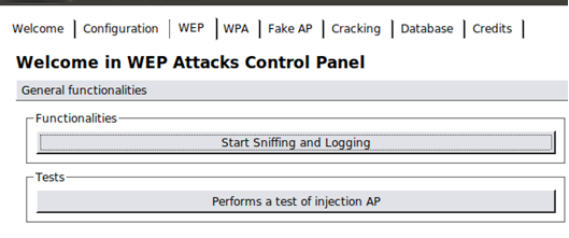

2.  在` Functionalities`（功能）中，点击` Start Sniffing and Logging `（开启嗅探和记录）按钮。

3.  点击 `WEP Attacks (No Client)`（WEP 攻击 无客户端）子标签页。

4.  点击` Start false access point authentication on victim `（开启目标上的伪造接入点验证）按钮。

5.  点击`Start the ChopChop attack`（开始断续攻击）按钮。

6.  在打开的终端窗口中，对`Use this packet `（使用这个封包）问题回答`Y`。

7.  完成之后，复制生成的`.cap`文件。

8.  点击` Create the ARP packet to be injected on the victim access  point`（创建注入到目标接入点的 ARP 封包）按钮。

9.  点击`Inject the created packet on victim access point`（将创建的封包注入到目标接入点）按钮。

0.  在打开的终端窗口中，对`Use this packet `问题回答`Y`。

1.  收集了大约 20000 个封包之后，点击`Cracking`（破解）标签页。

2.  点击`Aircrack-ng – Decrypt WEP Password`（解密 WEP 密码）按钮。

    这就结束了。
    
### 工作原理

这个秘籍中，我们使用了 Gerix 来自动化破解无线网络，为获得 WEP 密码。我们以启动 Gerix 并开启监控模式接口来开始这个秘籍。下面，我们从由 Gerix 提供的攻击目标的列表中选择我们的目标。在我们开始嗅探网络流量之后，我们使用  Chop Chop 来生成 CAP 文件。我们最后以收集 20000 个封包并使用 AirCrack 暴力破解 CAP 文件来结束这个秘籍。

使用 Gerix，我们能够自动化破解 WEP 密码的步骤，而不需要手动在终端窗口中键入命令。这是一种非常棒的方式，能够快速高效地破解 WEP 加密的网络。

## 9.4 使用伪造接入点连接客户端

这个秘籍中，我们会使用 Gerix 来创建并设置伪造接入点（AP）。建立伪造接入点让我们能够收集每个连接它的计算机的信息。人们通常会为了便利而牺牲安全。连接到开放无线接入点并发送简短的电子邮件，或登录到社交网络中非常方便。Gerix 是 AirCrack 的自动化 GUI。

### 准备

为了执行这个秘籍中的任务，需要Kali 终端窗口的经验。也需要受支持的配置好的无线网卡，用于封包注入。在无线网卡的例子中，封包注入涉及到发送封包，或将它注入到双方已经建立的连接中。


### 操作步骤

让我们开始使用 Gerix 创建伪造的 AP。

1.  让我们访问 Gerix 所在的目录：

    ```
    cd /usr/share/gerix-wifi-cracker
    ```
    
2.  键入下面的命令来使用 Gerix：

    ```
    python gerix.py
    ```
    
    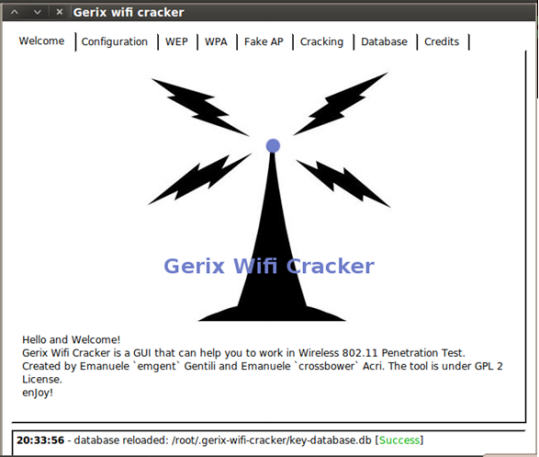
    
3.  点击` Configuration`（配置）标签页。

4.  在`Configuration`标签页中，选择你的无线接口。

5.  点击`Enable/Disable Monitor Mode`（开启/停止监控器模式）按钮。

6.  在监控模式启动之后，在` Select Target Network`（选择目标网络）下面，点击` Rescan Networks `（重新扫描网络）按钮。

7.  目标网络的列表会填满。选择无线网络作为目标。这里，我们选择了 WEP 加密的网络。

8.  点击`Fake AP`（伪造接入点）标签页。

    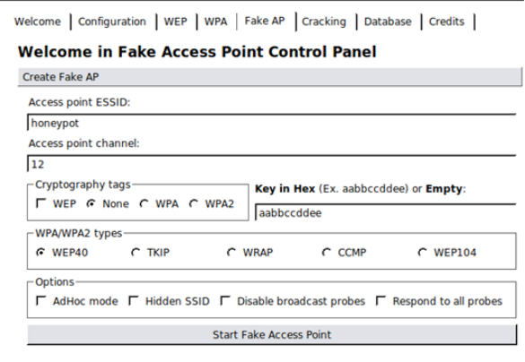
    
9.  修改` Access Point ESSID`（接入点 ESSID），将其从`honeypot`修改为不会引起怀疑的名称。这里我们使用` personalnetwork`。

    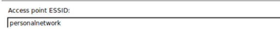
    
0.  其它选项使用默认。为了开启伪造接入点，点击` Start Face Access Point`（开启伪造接入点）按钮。

    
    
    这就结束了。
    
### 工作原理

这个秘籍中，我们使用了 Gerix 来创建伪造接入点。创建伪造接入点是一个非常好的方式，来收集没有防备用户的信息。原因是，对于受害者来说，它们表现为正常的接入点，所欲会使它被用户信任。使用 Gerix，我们可以只通过几次点击来自动化创建和设置伪造接入点。

## 9.5 URL 流量操纵

这个秘籍中，我们会进行 URL 流量操纵攻击。URL 流量操纵非常类似于中间人攻击，因为我们会让去往互联网的流量首先通过我们的机器。我们使用 ARP 毒化来执行这个攻击。ARP 毒化是一种技巧，让我们能够在局域网中发送欺骗性的 ARP 信息给受害者。我们会使用 arpspoof 来执行这个秘籍。

### 操作步骤

让我们开始进行 URL 流量操纵。

1.  打开终端窗口并执行下面的命令，来配置 IP 表使我们能够劫持流量：

    ```
    sudo echo 1 >> /proc/sys/net/ipv4/ip_forward
    ```
    
2.  下面，我们启动 arpspoof 来毒化从受害者主机到默认网关的流量。这个例子中，我们在局域网中使用 Windows 7 主机，地址为` 192.168.10.115`。Arpspoof 有一些选项，包括：

    +   `-i`允许我们选择目标接口。这里我们选择`wlan0`。
    +   `-t`允许我们指定目标。
    
    > 整个命令的语法是`arpspoof –i [interface] –t [target IP address] [destination IP address]`。
    
    ```
    sudo arpspoof –i wlan0 -t 192.168.10.115 192.168.10.1
    ```
    
3.  接着，我们执行另一个 arpspoof 命令，它会从上一个命令的目的地（这里是默认网关）取回流量，并使流量经过我们的 Kali 主机。这个例子中，我们的 IP 地址是` 192.168.10.110`。

    ```
    sudo arpspoof –i wlan0 -t 192.168.10.1 192.168.10.110 
    ```
    
    这就结束了。
    
### 工作原理

这个秘籍中，我们使用 arpspoof 通过 ARP 毒化来操纵受害者主机到路由器之间的流量，使其通过我们的 Kali 主机。一旦流量被重定向，我们就可以对受害者执行其它攻击，包括记录键盘操作，跟踪浏览的网站，以及更多。

## 9.6 端口重定向

这个秘籍中，我们使用 Kali 来进行端口重定向，也叫做端口转发或端口映射。端口重定向涉及到接收发往某个端口，比如 80 的数据包，并把它重定向到不同的端口上，比如 8080。执行这类攻击的好处很多，因为你可以将安全的端口重定向为非安全的端口，或者将流量重定向到特定的设备的特定端口，以及其它。

### 操作步骤


让我们开始进行端口重定向/转发。

1.  打开终端窗口并执行下列命令来配置 IP 表，使我们能够劫持流量：

    ```
    Sudo echo 1 >> /proc/sys/net/ipv4/ip_forward
    ```
    
2.  下面，我们启动 arpspoof 来毒化去往默认网关的流量。这个例子中，默认网关的 IP 地址为 ` 192.168.10.1`。Arpspoof 有一些选项，包括：

    +   `-i`允许我们选择目标接口。这里我们选择`wlan0`。
    
    > 整个命令的语法是`arpspoof –i [interface] [destination IP address]`。
    
    ```
    sudo arpspoof –i wlan0 192.168.10.1
    ```
    
3.  接着，我们执行另一个 arpspoof 命令，它会从上一个命令的目的地（这里是默认网关）取回流量，并使流量经过我们的 Kali 主机。这个例子中，我们的 IP 地址是` 192.168.10.110`。

    ```
    iptables -t nat -A PREROUTING -p tcp --destination-port 80 -j REDIRECT --to-port 8080
    ```
    
    这就结束了。
    
### 工作原理

这个秘籍中，我们使用 arpspoof 通过 ARP 毒化和 IPTables 路由，将网络上发到端口 80 的流量重定向到 8080。执行这类攻击的好处很多，因为你可以将安全的端口重定向为非安全的端口，或者将流量重定向到特定的设备的特定端口，以及其它。

## 9.7 嗅探网络流量

这个秘籍中，我们会实验网络流量的嗅探。网络流量嗅探涉及到拦截网络封包，分析它们，之后将流量解码（如果需要）来展示封包中的信息。流量嗅探特别在目标的信息收集中非常有用，因为取决于所浏览的网站，你可以看见所浏览的网址、用户名、密码和其它可以利用的信息。

我们在这个秘籍中会使用 Ettercap ，但是你也可以使用 Wireshark。处于展示目的，Ettercap 更加易于理解以及应用嗅探原理。一旦建立起对嗅探过程的理解，你可以使用 Wireshark 来进行更详细的分析。

### 准备

这个秘籍需要为封包注入配置好的无线网卡，虽然你可以在有线网络上执行相同步骤。在无线网卡的情况下，封包注入涉及到将封包发送或注入到双方已经建立的连接中。

### 操作步骤

让我们启动 Ettercap 来开始网络流量的嗅探。

1.  打开终端窗口并启动 Ettercap。使用`-G`选项加载 GUI：

    ```
    ettercap –G
    ```
    
    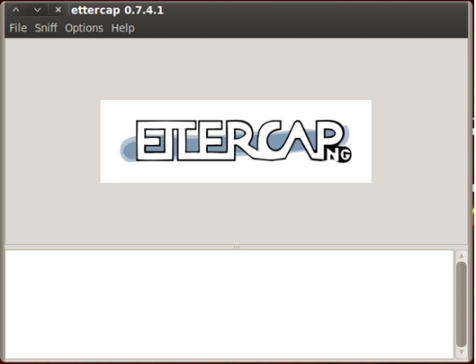
    
2.  我们以打开` Unified sniffing`（统一嗅探）开始。你可以按下`Shift + U`或者访问菜单中的` Sniff | Unified sniffing`。

    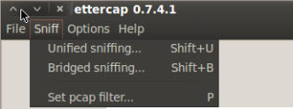

3.  选择网络接口。在发起 MITM 攻击的情况中，我们应该选项我们的无线接口。

    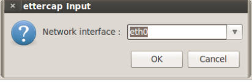
    
4.  下面，我们打开`Scan for hosts`（扫描主机）。可以通过按下`Ctrl + S`或访问菜单栏的` Hosts | Scan for hosts`来完成。

    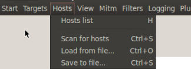

5.  下面，我们得到了`Host List`（主机列表）。你可以按下`H`或者访问菜单栏的`Hosts | Host List`。

    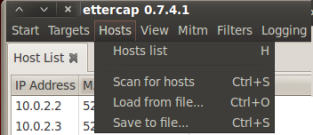
    
6.  我们下面需要选择或设置我们的目标。在我们的例子中，我们选择`192.168.10.111`作为我们的`Target 1`，通过选中它的 IP 地址并按下` Add To Target 1 `（添加到目标 1）按钮。

    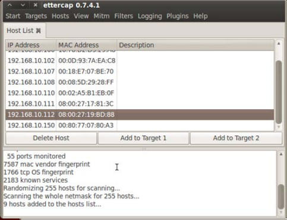
    
7.  现在我们能够让 Ettercap 开始嗅探了。你可以按下`Ctrl + W`或访问菜单栏的` Start | Start sniffing`。

    

8.  最后，我们开始进行 ARP 毒化。访问菜单栏的`Mitm | Arp poisoning`。

    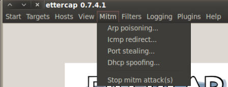

9.  在出现的窗口中，选中` Sniff  remote connections`（嗅探远程连接）的选项。

    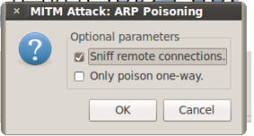

0.  取决于网络环境，我们会看到信息。

    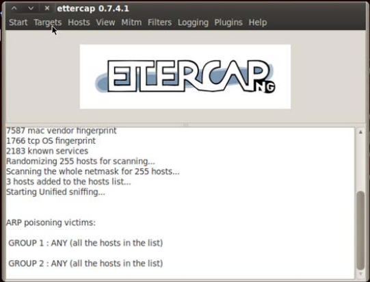

1.  一旦我们找到了想要找的信息（用户名和密码）。我们可以关闭 Ettercap。你可以按下`Ctrl + E`或访问菜单栏的`Start | Stop sniffing`来完成它。

    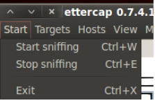

2.  现在我们关闭 ARP 毒化，使网络恢复正常。

    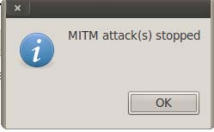

### 工作原理

这个秘籍包括了 MITM 攻击，它通过 ARP 毒化来窃听由用户发送的无线网络通信。我们以启动 Ettercap 并扫描主机来开始这个秘籍。之后我们开始进行网络的 ARP 毒化。ARP 毒化是一种技巧，允许你发送伪造的 ARP 信息给局域网内的受害者。

我们以启动封包嗅探并停止 ARP 毒化让网络恢复正常来结束。这个步骤在侦测过程中很关键，因为在你停止毒化网络时，它让网络不会崩溃。

这个过程对于信息收集很有用，因为它能收集到网络上传输的信息。取决于网络环境，你可以收集到用户名、密码、银行账户详情，以及其它你的目标在网络上发送的信息。这些信息也可以用于更大型攻击的跳板。
